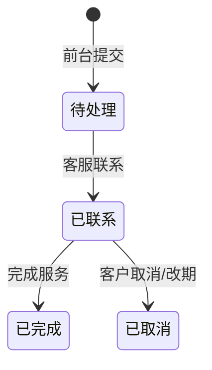
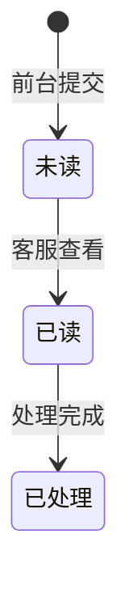
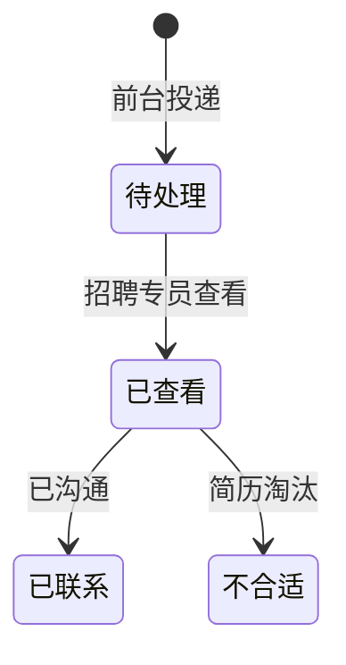

# TP 全屋家居 · UI/UX 设计文档

| 项目 | 内容 |
|------|------|
| 文档名称 | TP 全屋家居官网（前台展示系统）+ 后台管理系统 UI/UX 设计文档 |
| 文档版本 | v1.2 |
| 文档状态 | 评审中 |
| 编写日期 | 2026-08-18 |
| 品牌/产品 | TP 全屋家居 |
| 依据资料 | PRD v2.1（`TP全屋家居官网与后台管理系统PRD.md`）+ 数据库设计文档 v2.2（`TP全屋家居_数据库设计文档.md`）+ 前台高保真原型（`TP全屋家居_前台原型.html`）+ 后台高保真原型（`TP全屋家居_后台原型.html`，含功能增强版：编辑/上传/状态切换） |
| 使用技能 | `@skill:ui-ux-pro-max`（设计系统生成 / 组件状态与可达性规范） |

<!-- TOC:AUTO -->
## 目录

- [目录](#_1)
- [修订历史](#_2)
- [0. 阅读指南](#0)
  - [0.1 文档目的与读者](#01)
  - [0.2 与 PRD / 原型的关系](#02-prd)
  - [0.3 术语表](#03)
- [1. 设计原则与品牌基调](#1)
  - [1.1 设计原则](#11)
  - [1.2 品牌基调](#12)
  - [1.3 双端一致性原则](#13)
- [2. 设计系统（Design System / Tokens）](#2-design-system-tokens)
  - [2.1 色彩系统](#21)
  - [2.2 字体与排版](#22)
  - [2.3 间距与圆角](#23)
  - [2.4 阴影与层级](#24)
  - [2.5 图标与图形语言](#25)
  - [2.6 组件状态规范](#26)
- [3. 前台（官网）UI/UX](#3-uiux)
  - [3.1 信息架构与导航](#31)
  - [3.2 全局框架](#32)
  - [3.3 页面级规范](#33)
  - [3.4 关键组件库](#34)
  - [3.5 交互与状态](#35)
  - [3.6 关键用户流程](#36)
- [4. 后台（管理系统）UI/UX](#4-uiux)
  - [4.1 布局框架](#41)
  - [4.2 导航与权限（RBAC 菜单）](#42-rbac)
  - [4.3 通用组件](#43)
  - [4.4 模块级界面（BR-1 ~ BR-10）](#44-br-1-br-10)
  - [4.5 状态流转可视化](#45)
  - [4.6 交互与可达性](#46)
- [5. 响应式与多端适配](#5)
- [6. 可达性与合规](#6)
- [7. 组件状态总表与异常态清单](#7)
- [8. 设计验收标准](#8)
- [附录 A. 设计令牌速查表](#a)
- [附录 B. 原型文件索引与截图占位](#b)
- [附录 C. PRD 编号 ↔ UI/UX 章节对照表](#c-prd-uiux)
<!-- /TOC:AUTO -->

## 修订历史

| 版本 | 日期 | 修订人 | 修订说明 |
|------|------|--------|---------|
| v1.0 | 2026-08-18 | 产品通（架构通视角） | 依据 PRD v1.8 + 两套高保真原型撰写 UI/UX 设计文档初稿；双端共用墨金设计系统；与 PRD 编号（FR/BR/NFR）逐条对照 |
| v1.1 | 2026-08-18 | 产品通 | 同步后台原型功能增强 + PRD v1.9：① 后台布局"居中和谐"规范（内容区最大宽 1320px 居中、间距刻度统一，见 §4.1/§2.3/§5）；② 编辑操作带数据回填、新增即时上列表（§4.3/§4.4）；③ 上传支持点击选择本地文件、显示文件名（§4.3 Upload / BR-2.3）；④ 列表行内状态切换即时生效 + Toast（§4.3/§4.4）；基线 PRD v1.8→v1.9 |
| v1.2 | 2026-08-19 | 架构通 | 依据数据库设计文档 v2.2 + PRD v2.1 同步数据语义：① 产品中心/首页按**空间分类**（categories）筛选展示，产品卡片标注**所属系列**（series）与**产品编号**（§3.3）；② BR-2 产品管理字段更新（空间分类、系列、产品编号、规格参数 JSON、封面/其它图片、发布状态 上架/下架/**草稿**、置顶、排序）；③ BR-4 新闻字段更新（封面、**摘要**、正文、**来源**、是否发布、**置顶/推荐**、发布时间/**截止时间**）；④ BR-3/BR-5/BR-6 案例/职位/Banner 的上下架/上下线明确为**启用/禁用（is_activate）**，Banner 生效/失效时间窗；基线 PRD v1.9→v2.1 |

---

## 0. 阅读指南

### 0.1 文档目的与读者

本文档是 TP 全屋家居**前台官网 + 后台管理系统**的 UI/UX 设计规范（Design + UX Spec），回答"长什么样、怎么交互、设计约束是什么"，与 PRD（做什么/规则）互补。

- **目标读者**：UI 设计师（视觉还原）、前端工程师（前台 React+Tailwind / 后台 React+Ant Design 落地）、测试（视觉与交互验收）、产品与评审。
- **核心目标**：把两套高保真原型中已落地的视觉与交互，沉淀为**可复用、可验收**的设计规范，保证前后台风格统一、开发有据可依。
- **覆盖范围**：双端（前台展示系统 + 后台管理系统 RBAC）；平台 Web（前台 PC 为主兼顾移动端，后台桌面端为主）。
- **品牌基调**：高端大气（premium black + gold）——克制配色、大图留白、衬线标题。
- **可达性底线**：WCAG AA（对比度、键盘可达、可见焦点态）。

### 0.2 与 PRD / 原型的关系

- **PRD v2.1** 为功能与规则基线、**数据库设计文档 v2.2** 为字段与状态语义基线：本文档章节与 FR-x / BR-x / NFR-x 编号对齐，附录 C 给出「PRD 编号 ↔ 设计章节」对照。
- **原型为视觉事实来源**：本文档所有令牌、组件形态、交互态均取自两套原型实际落地值；原型与本文档冲突时，以原型为准并回写修正 PRD（见 §0.2 冲突处理）。
- 原型文件索引见附录 B。

> **冲突处理原则**：以原型已落地视觉为准；若原型与 PRD §4.1 表述有细微出入，以原型取值修正 PRD（可顺带回写 PRD 并升版）。

### 0.3 术语表

| 术语 | 含义 |
|------|------|
| Token / 令牌 | 设计系统的基础变量（颜色、字体、间距、圆角、阴影） |
| RBAC | 基于角色的访问控制（Role-Based Access Control） |
| WCAG | Web 内容无障碍指南（Web Content Accessibility Guidelines） |
| CTA | 行动号召按钮（Call To Action） |
| 线索 | 来自官网的预约 / 留言 / 简历投递三类客户信息 |
| 富文本 | 支持图文混排、多格式的编辑内容（后台录入，前台渲染） |
| Drawer / Modal | 抽屉（右侧滑出）/ 模态弹窗（居中） |
| 防刷 | 图形验证码 + 频率限制，防止表单被机器批量提交（FR-7.2） |

---

## 1. 设计原则与品牌基调

### 1.1 设计原则

1. **高端大气**：克制配色（墨 + 金 + 米白）、大图留白、衬线标题引领，呈现品质人居的品牌感。
2. **展示不交易**：官网为纯展示系统（PRD §3.2），无价格、无加购、无下单；一切视觉表达服务于"了解品牌、建立信任、产生线索"。
3. **内容驱动、前台只读**：所有展示内容由后台配置维护，前台为只读消费端；页面结构稳定，内容可变。
4. **双端同源**：前台与后台共用同一套设计令牌与组件语义，减少认知负担、降低实现成本。
5. **可访问、可落地**：默认满足 WCAG AA；所有规范给出可直接落地的数值（px / 对比度 / 断点）。

### 1.2 品牌基调

- **色彩意象**：近黑墨色 `#1C1917` 承载"沉稳、高级、质感"；香槟金 `#B0894F` 承载"温度、轻奢、点缀"；米白 `#FAFAF9` 承载"留白、呼吸感"。
- **文字调性**：标题衬线（Cormorant Garamond / Noto Serif SC），正文无衬线（Montserrat / Noto Sans SC）；文案克制、专业、有温度。
- **图片语言**：大图优先、实景质感、低饱和色调；原型中以占位图（深墨渐变 + 金辉光晕）示意。
- **情感关键词**：从容、温度、留白、匠艺、长期主义。

### 1.3 双端一致性原则

- **令牌同源**：色彩 / 字体 / 间距 / 圆角 / 阴影使用同一套 CSS 变量（前台 `--c-*`，后台 `--primary/--gold/...`，取值一致）。
- **组件语义对齐**：前台 Button ↔ 后台 btn-sm、前台 Tag ↔ 后台 tag、前台 Tabs ↔ 后台 tabs 等，交互逻辑一致。
- **强调色统一为金**：后台已取消 Ant Design 蓝（`#1677ff` 系），聚焦态 / 菜单选中态 / 图表配色均套用金 / 墨令牌（PRD §4.1）。

---

## 2. 设计系统（Design System / Tokens）

> 本节为双端共用基线，取值直接来自两套原型。

### 2.1 色彩系统

**主色板（核心令牌）**

| 令牌 | 值 | 用途 |
|------|----|------|
| `--c-ink / --primary / --sider` | `#1C1917` | 墨色：主按钮填充、侧栏底、主文字、强背景 |
| `--c-ink-2` | `#44403C` | 次级文字（正文强调） |
| `--c-muted` | `#78716C` | 弱化文字（说明、时间戳、占位） |
| `--c-gold / --gold` | `#B0894F` | 香槟金：CTA、强调、选中态、链接、装饰 |
| `--c-gold-d / --gold-d` | `#97763F` | 金色按下 / 深 hover |
| `--c-bg / --bg` | `#FAFAF9` | 米白页面底 |
| `--c-surface / --surface` | `#FFFFFF` | 卡片 / 弹层 / 表单表面 |
| `--c-soft / --soft` | `#F5F3EF` | 浅金灰区块底（交替区块、标签底） |
| `--c-line / --line` | `#E7E5E4` | 描边 / 分隔线 |
| `--c-line-strong` | `#D3D1C7` | 强调描边（输入框、控件边框，后台 `--border-strong:#d9d9d9`） |

**后台层次态（墨金体系内）**

| 令牌 | 值 | 用途 |
|------|----|------|
| `--primary-hover` | `#2b2723` | 主按钮 hover |
| `--primary-active` | `#000c17` | 主按钮按下 |
| `--sider-hover` | `#B0894F` | 侧栏菜单 hover 金色 |
| `--sider-sub` | `#14110F` | 侧栏二级菜单底 |
| `--processing` | `#B0894F` | 处理中 / 强调状态（原蓝改为金） |

**语义色（状态反馈）**

| 语义 | 值 | 前台用途 | 后台用途 |
|------|----|---------|---------|
| 成功 success | `#52C41A` | — | 上架 / 已发布 / 已完成 / 启用 标签 |
| 警告 warning | `#FAAD14`（文字 `#D46B08`） | — | 待处理 / 草稿 / 待查看 标签 |
| 错误 error | `#FF4D4F`（文字 `#B42318`） | 表单校验错误文字/边框 | 删除 / 禁用 / 未读 / 不合适 标签 |
| 信息 info | 墨 `#1C1917` / 金 `#B0894F` | 公告、提示条 | note 提示框、scope-tip |

**对比度**（均已实测满足 WCAG AA）：
- 墨底白字 ≈ 17:1；金色文字对墨底 ≈ 5.4:1；米白底墨字 ≈ 15:1；弱化文字 `#78716C` 对白底 ≈ 4.6:1。

### 2.2 字体与排版

**字体对（双端统一）**

| 角色 | 字体 | 应用 |
|------|------|------|
| Display / 标题 | `Cormorant Garamond` + `Noto Serif SC`（衬线） | 品牌名、H1–H4、页标题、弹窗标题、图表标题 |
| Body / 正文 | `Montserrat` + `Noto Sans SC`（无衬线） | 正文、按钮、标签、表格、表单 |

> 中文优先 `Noto Serif SC` / `Noto Sans SC`；西文优先 Cormorant / Montserrat；缺失回退 Georgia / 系统 sans-serif。

**字号梯度（Type Scale）**

| 层级 | 前台值 | 后台值 | 字重 | 行高 |
|------|--------|--------|------|------|
| Display（Hero） | `clamp(40px,6vw,76px)` | — | 600 | 1.2 |
| H1 | `clamp(28px,4vw,44px)` | — | 600 | 1.2 |
| H2（区块标题） | `clamp(26px,3.4vw,40px)` | — | 500–600 | 1.2 |
| H3（卡片标题） | 20–22px | 16–17px | 500–600 | 1.2–1.3 |
| H4（小节标题） | 14–16px | 15px | 500–600 | 1.3 |
| Body（正文） | 14–16px | 14px | 400 | 1.7（前台）/ 1.6 |
| Small（辅助） | 12–13px | 12–13px | 400 | 1.6 |
| Caption / Eyebrow | 11–12px（`letter-spacing:.14–.32em`，uppercase） | 12px | 600 | 1.5 |

**使用规则**
- 标题一律衬线；正文一律无衬线；数字展示（统计卡）用衬线大字号（如前台 `stats .n` 52px Cormorant）。
- Eyebrow 小标（如 `PRODUCT SERIES`）为金色、全大写、宽字距，置于区块标题上方。

### 2.3 间距与圆角

**间距刻度（`--sp-*`）**

| 令牌 | 值 | 典型用途 |
|------|----|---------|
| `--sp-1` | 4px | 微距（图标与文字间隙） |
| `--sp-2` | 8px | 标签内边距、紧凑间隙 |
| `--sp-3` | 12px | 表单字段垂直间距、面包屑 |
| `--sp-4` | 16px | 卡片内边距、栅格 gap 小 |
| `--sp-5` | 24px | 标准内边距、栅格 gap 中 |
| `--sp-6` | 32px | 区块内标题间距 |
| `--sp-7` | 48px | 大区块分隔 |
| `--sp-8` | 72px | 页面级留白 |
| `--sp-9` | 112px | 首页大区块留白 |

**圆角**

| 令牌 | 前台 | 后台 | 用途 |
|------|------|------|------|
| `--r-sm` | 8px | 6px | 输入框、按钮、标签、表格控件 |
| `--r` | 14px | 8px | 卡片、弹层、抽屉 |
| `--r-lg` | 22px | 12px | 大图块、Hero、CTA 条、登录卡 |

**规则**：卡片 `border-radius: var(--r)` + `border:1px solid var(--c-line)`；胶囊按钮 `border-radius:999px`（前台）；后台按钮/输入 6px、卡片 8px。

**后台间距刻度（v1.9 落地，保证居中和谐）**：

| 场景 | 值 |
|------|----|
| 内容区内边距（与视口/侧栏间距） | 左右 32px、上下 28px |
| 卡片（.page-card）内边距 | 24–28px（左右 28 / 上下 24） |
| 区块间（标题 ↔ 工具栏 ↔ 表格） | 20–22px |
| 表格单元格内边距 | 上下 14px、左右 16px |
| 操作列链接间距 | ≥10px（`margin-right:10px`） |
| 状态标签内边距 | 上下 2px、左右 10px（行高 22px） |
| Tab 内边距 / Tab 条下边距 | 11/18px / 22px |
| 表单字段行距 / 输入框高度 | 18px / 34–36px（登录框 40px） |

### 2.4 阴影与层级

| 令牌 | 值 | 用途 |
|------|----|------|
| `--shadow-sm` | `0 1px 2px rgba(28,25,23,.05)` | 卡片常态 |
| `--shadow` | `0 10px 30px rgba(28,25,23,.08)` | 卡片 hover、轮播、Banner |
| `--shadow-lg` | `0 24px 60px rgba(28,25,23,.14)` | 下拉、弹窗、抽屉、Toast |

**层级约定（z-index）**：Header sticky 50 → 遮罩 50 → 抽屉/弹窗 60 → Toast 99（后台 Toast 200）；前台下拉不设层级（随文档流），移动端菜单 50 内。

### 2.5 图标与图形语言

- **风格**：线性图标（stroke 2、圆角端点），金色或当前文字色描边；禁用 emoji 作为业务图标（视觉规范），文案图标除外（后台原型菜单 emoji 为演示占位，实现时替换为 SVG/Lucide 图标库）。
- **来源建议**：Lucide / Heroicons（线性风格与墨金体系匹配）。
- **品牌 Mark**：方形深墨底 + 金色边框 + 金色 "TP" 衬线字（前台 Logo、后台侧栏、登录卡三处同源样式，圆角 6–8px）。
- **点缀**：金色圆点、金色左条（页标题/统计卡）、金色渐变光晕（图片占位、头像）。

### 2.6 组件状态规范

所有可交互组件必须覆盖以下状态（双端通用）：

| 状态 | 规范 |
|------|------|
| default | 基准样式（见各组件） |
| hover | 前台：上浮 1–3px + 阴影加深 / 金底反白；后台：金描边 + 金字 / 墨底 |
| active / pressed | 颜色加深（金 `--c-gold-d`、墨 `--primary-active`） |
| disabled | 降低对比（前台不启用；后台按钮 50% 透明 / 灰底），`cursor:not-allowed` |
| focus | **金色 2px 焦点环**：输入类 `box-shadow:0 0 0 3px rgba(176,137,79,.15)`；按钮焦点环同金 |
| loading | 按钮内转圈 / 区块骨架屏（前台 `skeleton` 渐变扫光动画 1.2s） |
| empty | 空态插画 + 文案 + 建议动作（前台虚线框、后台 `.empty`） |
| error | 错误边框 `#B42318` + 错误提示文字（表单字段下方 `.err`）；提交失败 Toast |

> 焦点环统一金色（非蓝色），保证键盘导航可见（WCAG 2.4.7）。

---

## 3. 前台（官网）UI/UX

### 3.1 信息架构与导航

**顶部主导航（5 项，与 PRD §5 一致）**

| 主导航 | 二级导航 | 路由 |
|--------|---------|------|
| 首页 | — | home |
| 产品 | 产品中心、新案例展示 | product / case |
| 新闻 | 企业新闻、行业资讯 | news（tab: corp / ind） |
| 招聘入口 | 社会招聘、校园招聘 | recruit（tab: social / campus） |
| 关于我们 | 关于TP、发展历程、品牌介绍、联系我们 | about / about-history / about-brand / contact |

**导航行为**
- 一级项含下拉的为按钮 + caret（旋转动画），hover / focus-within 展开下拉（面板 `--shadow-lg` + 上滑 6px 过渡）。
- 当前路由对应一级项金色高亮；下拉内当前页金色加粗（`.cur`）。
- 面包屑：二级页顶部 `首页 / 上级 / 当前`，可点击回退。
- 移动端（≤768px）：菜单折叠为汉堡；展开后面板全宽、二级下拉内联展开。

**顶部公告条（FR-7.5）**：主导航上方 38px 深墨条，居中文案 + 右侧可关闭（×），文案由后台配置。

**页脚（FR-1.9）**：深墨底，四栏（品牌简介 / 产品 / 新闻 / 关于），底部版权 + ICP 备案 + 隐私政策/用户协议；**全局联系信息条**置于页脚最下方，四格（地址 / 电话 / 邮箱 / 时间），金色图标 34px 圆角方块，电话 `tel:`、邮箱 `mailto:` 可点。

### 3.2 全局框架

- **容器**：`.wrap` 最大宽 1240px，水平内边距 24px，居中。
- **Header**：sticky 吸顶，`rgba(250,250,249,.86)` + 12px 毛玻璃（backdrop-filter），高 72px，底部 1px 分隔线；右侧「在线预约」金色胶囊按钮。
- **内容页骨架**：面包屑 → 区块标题（eyebrow + H2）→ 内容区；大区块以米白 / 浅金灰（`--c-soft`）交替分区。
- **响应式断点**：1440（桌面）/ 1024（平板 2 列）/ 768（移动单列 + 汉堡），详见 §5。

### 3.3 页面级规范

**① 首页（FR-1）**
区块顺序：Hero（eyebrow + H1 + slogan + 双 CTA + 轮播）→ 空间分类入口（g4 卡片）→ 新案例展示（g3，浅金灰底）→ 新闻动态（g3）→ 品牌实力（墨底四格数字）→ 服务流程四步（FR-1.10）→ 客户评价三卡（FR-1.11）→ CTA 条（预约 + 招聘）。
- Hero：深墨径向渐变背景 + 金辉光晕，H1 `clamp(40px,6vw,76px)` 白色衬线，slogan 米金色。
- 轮播：300px 高、圆角 22、每 4.5s 自动切换 + 圆点指示（金色当前态），底部左侧文案。
- 品牌实力：`stats` 墨底圆角大卡，数字 52px 金色衬线（18 年 / 2600+ / 32 / 98%）。
- 服务流程：四卡 + 金色序号（01–04）+ 步骤间金色箭头（≤1024px 隐藏）。
- 客户评价：五星金色、头像圆形渐变（姓名首字）、城市户型标注。

**② 产品中心（FR-2）**
- **空间分类** Tabs 筛选（全部 / 客厅 / 卧室 / 书房 / 餐厅 / 全屋，来自 categories）+ **系列**筛选（如胡桃木，来自 series）→ 产品卡片 g3（占位图 200px + 名称 + 系列 + 简介），卡片点击进入产品详情（原型以列表演示）。
- 详情布局（FR-2.3 演示结构）：`detail-wrap` 双栏（主图 1.5fr + 说明 1fr），参数表 `spec`（规格参数 JSON 键值对分行），右侧 sticky `aside` 附相关信息（产品编号、空间分类、系列）。

**③ 新案例展示（FR-3）**
- Tabs 类型筛选（全部 / 客户实景 / 设计方案）→ 案例卡 g3（封面 + 类型金色 tag + 标题 + 风格 · 空间）。

**④ 新闻（FR-4）**
- Tabs 分类（企业新闻 / 行业资讯）→ 新闻卡 g3（封面 + 金色日期 + 标题 + 摘要）；详情含上一篇/下一篇（原型以列表演示）。

**⑤ 招聘入口（FR-5）**
- Tabs 分类（社会招聘 / 校园招聘）→ 职位卡 g2（tag + 职位名 + 部门 · 地点 · 薪资 + "查看详情并投递 →"金色入口）。
- **职位详情页**（p-job）：双栏——左 JD（eyebrow 类型、职位名、meta、岗位职责、任职要求）；右 sticky 投递表单（见 §3.4 Form）。

**⑥ 关于我们（FR-6）**
- 关于TP：双栏（正文 + 主视觉大图占位），含核心价值观列表。
- 发展历程：金色左侧时间轴（年份 30px 金色衬线 + 事件），圆点金色描边。
- 品牌介绍：品牌故事 / 理念文字 + 荣誉资质 g4 卡片（奖杯占位 + 名称）。
- 联系我们：左——联系信息列表（地址/电话/邮箱/时间）+ 合规地图占位（260px 棋盘格底，注明腾讯地图）；右——Tabs 在线预约 / 在线留言（表单见 §3.4）。

### 3.4 关键组件库

| 组件 | 形态与状态 | PRD 关联 |
|------|-----------|---------|
| Button | `primary`（金底白字，hover `--c-gold-d` 上浮）/ `ghost`（透明墨边，hover 墨底白字）/ `line`（灰边，hover 墨边）/ `ghost-light`（白边白字，hero 内用，hover 白底墨字）；胶囊 999px，13px 26px；`transition:all .2s` | FR-1.8 |
| Card / Tile | 白底 1px 灰边 14px 圆角，hover 阴影 `--shadow` + 上浮 3px；图片区 200px 占位 | FR-2.2 |
| Tag | 金色文字 + 灰边胶囊，11px 大写宽字距；用于类型/标签 | FR-3.2 |
| Banner 轮播 | 3 张 slide 淡入淡出 0.6s + 圆点指示（金色 on），4.5s 自动，右下圆点 | FR-1.2 |
| Tabs | 下划线式：`border-bottom:2px solid` 金色当前项 + 加粗 | FR-2/3/4/5 |
| Breadcrumb | 灰字 `首页 / 当前`，斜杠分隔，hover 金色 | 通用 |
| Form | 字段容器 `.field`：label（13px 600）+ 输入框（14px，focus 金边+3px 金晕）+ `.err` 红字；`.invalid` 红边框；`.row2` 双列；隐私授权 `.check`（金色 accent 复选框 + 链接） | FR-5.4/6.4.3/6.4.4 |
| Dropdown | 白底 `--shadow-lg` 圆角，项 hover 浅金灰 + 金字；hover/focus-within 展开 | 导航 |
| Toast | 底部居中深墨胶囊，白字，`--shadow-lg`，2.6s 自动消失，上滑淡入 | 通用 |
| Timeline | 左侧金色 2px 线 + 金色圆点，年份 30px 金色衬线 | FR-6.2 |
| Steps | 四步卡片 + 金色序号 + 步骤间箭头 | FR-1.10 |
| Reviews | 白卡：五星金 + 评价 + 头像圆（姓名首字）+ 城市户型 | FR-1.11 |
| Modal / Drawer | 职位详情以独立页呈现（p-job）；预留弹层样式与后台一致 | FR-5.3 |
| Skeleton | 渐变扫光占位（200px 高） | FR-7.4 |
| Empty | 虚线框 + 居中灰字"暂无内容" | FR-7.4 |

### 3.5 交互与状态

**表单校验（预约 / 留言 / 简历）**

| 表单 | 必填字段 | 校验规则 | 提示文案 |
|------|---------|---------|---------|
| 在线预约（FR-6.4.4） | 姓名、手机号、预约日期+时段、验证码 | 手机号 `^1[3-9]\d{9}$`；日期 ≥ 今日；时段来自后台配置 | "请填写姓名 / 请输入正确的手机号 / 请选择不早于今日的日期 / 请选择时段 / 验证码错误" |
| 在线留言（FR-6.4.3） | 姓名、联系方式、留言内容、验证码 | 联系方式 ≥5 字符；内容 ≥2 字符 | 同上模式 |
| 投递简历（FR-5.4） | 姓名、手机号、应聘职位（自动带出）、简历附件 | 手机号正则；附件 PDF/Word ≤10MB | "仅支持 PDF/Word，且 ≤10MB" |

**通用交互规则**
- 图形验证码：深墨渐变底金色粗体 4 位（2 字母 + 2 数字），点击刷新（`genCap()`）；提交时大小写不敏感比对。
- 隐私授权：三个表单均含"我已阅读并同意《隐私政策》，授权 TP 处理我的个人信息"复选框，未勾选提交时 Toast 提示"请先勾选同意隐私政策"（FR-7.3 / NFR-3）。
- 提交成功 Toast："预约成功，工作人员将尽快与您联系" / "留言已提交，客服将尽快回复" / "投递成功，招聘专员将尽快查看"；失败 Toast"请检查标红项后重试"。
- 校验失败：字段红边框 + 下方红字；不弹系统 alert。
- 加载：列表骨架屏；空态虚线框。
- 图片懒加载（FR-7.4）；`prefers-reduced-motion` 时禁用全部动画。

### 3.6 关键用户流程

```
① 预约流程：首页/联系我们 → 联系我们页 → Tab「在线预约」→ 填写姓名/手机/日期/时段/备注 + 验证码 + 勾选授权 → 提交 → Toast 成功 → 后台「在线预约管理」可查可处理
② 留言流程：联系我们页 → Tab「在线留言」→ 填写姓名/联系方式/内容 + 验证码 + 授权 → 提交 → Toast 成功 → 后台「留言咨询管理」可查可处理
③ 投递流程：招聘入口 → 社会/校园 → 职位卡 → 职位详情（JD + 表单）→ 填写字段 + 上传附件 + 授权 → 提交 → Toast 成功 → 后台「简历投递管理」可查可处理
```

> 三条路径均为"前台提交 → 后台处理"闭环；提交记录前台不可见、仅后台按角色隔离可见（PRD §10.1）。

---

## 4. 后台（管理系统）UI/UX

### 4.1 布局框架

- **登录页（BR-1.1）**：全屏墨色渐变（`#211c17 → #1C1917 → #0d0b09`）居中白卡（400px、圆角 14、`0 12px 40px` 投影）；品牌 Mark + 名称 + 副标题；账号/密码输入（focus 金晕）+ 金色主题登录按钮；底部"演示角色快速进入"四角色 chips（hover 金）。
- **主框架**：固定侧栏（220px，墨底） + 顶栏（64px 白底） + 内容区（米白底滚动）。
- **侧栏**：Logo 区（TP Mark + 名称 + 副标题）→ 菜单树（`menu-item` 默认白 75%、hover 白底 8%、active 金字 + 金左条 3px + 金底 16%）；可折叠（80px，仅图标）。
- **顶栏**：左侧折叠按钮 + 面包屑（`上级 / 当前`）；右侧角色徽标（金边金字圆角胶囊）+ 用户区（头像 32px 圆形 + 昵称），点击打开个人中心。
- **内容区（居中和谐）**：`.content` 在侧栏右侧区域内**居中显示**（`max-width:1320px; margin:0 auto; padding:28px 32px`），大屏下左右留白对称、不出现单侧大面积空白；页内统一 `.page-card`（白底 8px 圆角 + 阴影 + 24/28px 内边距，在居中区内 100% 撑满）；页标题 `.page-title`（衬线 22px + 金色左条 3px）。间距刻度见 §2.3 后台间距表。

### 4.2 导航与权限（RBAC 菜单）

菜单按角色过滤渲染（原型 `ROLES` + `renderMenu` 实现，对应 PRD §8 矩阵）：

| 菜单组 | 子项 | 超管 | 内容编辑 | 客服 | 招聘专员 |
|--------|------|:---:|:---:|:---:|:---:|
| 工作台（看板） | — | ✅（全部线索） | — | ✅（预约+留言） | ✅（简历） |
| 内容管理 | 产品 / 案例 / 新闻 / 页面内容·Banner | ✅ | ✅ | — | — |
| 招聘管理 | 职位 / 简历投递 | ✅ | ✅（职位） | — | ✅ |
| 线索管理 | 在线预约 / 留言咨询 | ✅ | — | ✅ | — |
| 系统管理 | 账号 / 角色 / 操作日志 | ✅ | — | — | — |

- **前端规则**：无权限菜单不渲染（不做"点了再报错"）；有权限菜单 hover/active 样式正常。
- **无权限兜底**：若直接访问无权限视图，显示 `🔒 当前角色无此模块权限` 空态（原型 `no-perm`）。
- **按钮级权限**：同一页面内操作按角色显隐（如"新增产品"仅内容编辑/超管可见）。

### 4.3 通用组件

| 组件 | 规范 | PRD 关联 |
|------|------|---------|
| Table | 表头浅灰底 500 字重、行 hover `#fafafa`、单元格 14/16px 内边距（行距舒展）；列按业务；**操作列**为"编辑 / 状态切换 / 删除"金色 link（删除红色），链接间距 ≥10px；**「编辑」点击打开带现有数据回填的编辑表单（Modal），保存后更新列表并 Toast 提示**；**状态列支持行内直接切换**（上架↔下架、发布↔下架、上线↔下线、启用↔禁用、招聘中↔已暂停，点击即时生效 + Toast） | 通用 / §7 通用约定 |
| Toolbar | 搜索框（220px）+ 筛选 select + 右侧主操作按钮（`btn-sm primary` 墨底白字）；「+ 新增」支持新增后即时上列表 | 通用 |
| 状态 Tag | `tag-success`（绿）/ `tag-processing`（金）/ `tag-warning`（橙）/ `tag-error`（红）/ `tag-default`（灰）/ `tag-gold`（金边）；内边距 2/10px、行高 22px | 通用 |
| Form（Modal/Drawer 内） | `.form-row`：label（13px 灰）+ `form-input` 36px（focus 金晕）+ 必填红星；行距 18px；`seg` 分段选择（当前项墨底白字）；编辑表单**预填现有值**，保存校验后写回列表 | BR-2~6 |
| Modal | 560px 居中白卡，`.modal-head/body/foot`，底部右对齐"取消/主操作"；编辑态标题带对象名（如"编辑产品 · 云隐布艺沙发"） | BR-2~10 |
| Drawer | 右侧 440px 滑出（0.25s），head + body + foot；用于详情/处理 | BR-5.2/7/8 |
| Upload | 虚线框上传区（点击/拖拽），**点击即调用本地文件选择器**，选中后显示文件名与大小；图片管理页的图片格**点击可直接替换**；提示类型与大小白名单 | BR-2.3 |
| Chart | 折线（SVG path 金 `#B0894F` 2.5px + 圆点）、柱状（金 / 品牌绿 `#52C41A`）；坐标轴灰 `#999` | BR-9 |
| 分页 | 右下角"共 N 条 + 页码（当前墨底白字）" | 通用 |
| 二次确认 | 删除/禁用等敏感操作 `confirm('确认删除…此操作将记录日志')` | §10.3 |
| Toast | 顶部居中白卡（✓ 绿 / ⚠ 红），1.8s 自动消失 | 通用 |
| 个人中心 | 头像 64px（点击/按钮上传，JPG/PNG/GIF/WebP ≤2MB，FileReader 预览）+ 修改密码（原密码 + 新密码 ≥6 位 + 确认一致）+ 退出登录 | BR-1.4 |

### 4.4 模块级界面（BR-1 ~ BR-10）

| 模块 | 页面要点 |
|------|---------|
| BR-1 登录与权限 | 见 §4.1；个人中心含头像上传 + 修改密码 + 退出（`showUserMenu` 弹窗） |
| BR-2 产品管理 | Tabs：产品 / 空间分类 / 图片管理；产品列表含名称、**空间分类**、**系列**、**产品编号**、**规格参数**、排序、**发布状态**、操作（编辑/上架↔下架/删除）；新增/编辑 Modal（名称、空间分类下拉、系列、产品编号、封面/其它图片上传、规格参数键值对、富文本描述、排序、发布状态 seg：**上架/下架/草稿**、**置顶**），**编辑自动回填、保存写回列表**；空间分类 Tab 支持编辑/停用↔启用/删除（提示"有关联产品禁止删除"）；图片 Tab 网格**点击图片格或「上传图片」按钮即选择本地文件替换** |
| BR-3 案例管理 | Tabs：案例列表（类型/风格/空间筛选）/ 标签维护（风格、空间字典表）；案例列表操作含**编辑（回填标题/类型/风格/空间/面积/封面图/上下架状态）、上架↔下架（以启用/禁用 is_activate 实现）、删除** |
| BR-4 新闻管理 | 列表（标题、分类 tag、封面图、**摘要**、发布时间、**截止时间**、作者、**发布状态**）+ 写文章/编辑 Modal（封面图选择、**摘要**、富文本正文、**来源（转载标注）**、**发布时间/截止时间**、**是否发布**、**置顶/推荐**）+ 操作列**发布↔下架（is_published）、置顶/推荐、删除** |
| BR-5 招聘管理 | 职位管理（类型/部门/地点/薪资/上下架状态），操作含**编辑（JD 表单回填）、招聘中↔已暂停（以启用/禁用 is_activate 实现）、删除**；简历投递管理（状态筛选、手机号/姓名搜索、附件下载、状态流转 seg：待处理→已查看→已联系/不合适、跟进备注） |
| BR-6 页面内容/Banner | Tabs：Banner（标题、跳转链接、排序、上下线状态、生效/失效时间），操作含**编辑（含图片选择）、上线↔下线（以启用/禁用 is_activate 实现）、删除**；关于TP / 品牌介绍（富文本 + **封面图片可选上传**）；发展历程（时间轴条目**支持编辑/删除/新增**，年份+事件表单回填）；联系我们（地址、电话、邮箱、工作时间、地图坐标、预约时段选项维护——与前台 FR-6.4.1 同源） |
| BR-7 在线预约管理 | 列表（姓名脱敏、手机脱敏、日期、时段 tag、备注、状态）+ 处理 Drawer（状态流转 待处理→已联系→已完成/已取消 + 处理记录备注）+ 提醒设置 |
| BR-8 留言咨询管理 | 列表（姓名、联系方式、内容、状态：未读/已读/已处理）+ 处理 Drawer（状态流转 + 备注） |
| BR-9 数据看板 | 统计卡（预约/留言/简历，按角色维度）+ 趋势折线 + 分类柱状 + 明细下钻表（今日/本周/本月 + 下钻链接）；顶部 scope-tip 标注数据范围 |
| BR-10 系统管理 | 账号管理（增删改、**启用↔禁用、重置密码**，编辑回填账号/昵称/角色/状态）；角色管理（角色列表 + 配置权限 Modal：勾选菜单/操作权限树）；操作日志（操作人、操作、对象、时间 + 搜索） |

> 姓名/手机号在后台列表**脱敏展示**（张** / 138****8821），详情内完整显示——最小化暴露个人信息（NFR-3）。

### 4.5 状态流转可视化

**预约（BR-7.2）**



**留言（BR-8.2）**



**简历（BR-5.2）**



**看板角色维度（BR-9）**：客服→预约+留言；招聘专员→简历；超管→全部；内容编辑无看板权限。看板展示原始条数（不去重），北极星指标"有效线索数"按手机号去重合并（PRD §12）。

### 4.6 交互与可达性

- **二次确认**：删除 / 禁用账号等敏感操作弹确认（`confirm`），确认后 Toast 反馈并记操作日志（§10.3）。
- **操作反馈**：所有写操作（保存/状态流转/上传）均有 Toast；表单必填红星 + 校验错误行内提示。
- **键盘导航**：弹窗/抽屉打开后焦点移入，Esc 关闭（原型为演示，实现需补 focus trap）；菜单项可 Tab 遍历、Enter 触发。
- **焦点态**：金色 2px 焦点环（输入、按钮、链接），不用蓝色。
- **对比度**：菜单金字对墨底 ≈5.4:1；主按钮墨底白字 ≈17:1；弱化文字 ≥4.5:1。
- **脱敏**：列表手机号/姓名脱敏（见 §4.4）。

---

## 5. 响应式与多端适配

| 断点 | 前台 | 后台 |
|------|------|------|
| ≥1440（桌面） | 容器 1240px 居中；g4 四列 | 侧栏 220px 全展开；内容区 1320px 居中 |
| 1024（平板） | g4→2 列、stats→2 列、detail/contact 双栏→单列、steps/reviews→2 列（隐藏箭头）、aside 变静态 | 保持桌面布局 |
| 768（移动） | 汉堡菜单（全宽下拉内联）、g3/g2/g4→1 列、row2→1 列、页脚联系条 2 列、hero 内边距 64px、区块留白降为 `--sp-8` | 侧栏收起为 0（隐藏）、内容全宽、统计卡 2 列 |
| ≤420 | 页脚联系条 1 列 | — |

- 触摸目标：按钮/链接点击区 ≥32px 高（前台按钮 46px、后台按钮 32px 已达标）。
- 图片自适应：`img{max-width:100%}`；表单输入 `width:100%` 随容器伸缩。
- 滚动行为：路由切换 `scrollTo(top)`；`prefers-reduced-motion` 禁用动画/过渡。

---

## 6. 可达性与合规

**WCAG AA 要点**
- 对比度：全部文字/背景组合 ≥4.5:1（正文）、≥3:1（大号文字/装饰），关键组合已实测（见 §2.1）。
- 键盘：全部交互可达（菜单、Tab、按钮、表单）；焦点可见金色环。
- 语义：使用原生 button/a/input + label；图片占位有文字说明。
- 动效：`prefers-reduced-motion` 关闭动画；轮播可手动切换圆点。

**合规（呼应 PRD NFR-3）**
- 表单收集点明示《隐私政策》并勾选授权（前台三表单已实现）。
- ICP 备案号展示于页脚（示意占位）。
- 地图使用合规服务（腾讯地图等），坐标采用中国大陆标准地图，不使用未审图数据。
- 后台个人信息脱敏展示、仅授权角色可见、操作留痕。

---

## 7. 组件状态总表与异常态清单

| 场景 | 前台呈现 | 后台呈现 |
|------|---------|---------|
| 加载中 | 列表骨架屏（渐变扫光）；图片懒加载 | 表格加载态（原型为演示占位） |
| 空数据 | 虚线框 + "暂无内容" | `.empty`：居中灰字 + 图标（40px） |
| 表单错误 | 字段红边 + 行内红字 + Toast | 字段红边 + 行内红字（`err.show`） |
| 提交失败 | Toast"请检查标红项后重试" | Toast（⚠ 红） |
| 无权限 | —（前台无登录体系） | `🔒 当前角色无此模块权限` |
| 网络/系统异常 | Toast 错误提示 | Toast（⚠ 红）+ 操作日志记录 |
| 删除/禁用 | — | `confirm` 二次确认 + 日志 |

---

## 8. 设计验收标准

| # | 验收项 | 判定 | 对应 |
|---|--------|------|------|
| 1 | 双端色彩/字体/间距/圆角/阴影与附录 A 令牌一致 | 截图比对令牌值 | §2 / NFR-5 |
| 2 | 前台 10 页与原型结构一致（导航 5 组、区块顺序、表单字段） | 逐页走查 | §3 / FR-1~6 |
| 3 | 三表单校验规则、验证码、隐私授权、Toast 文案与 §3.5 一致 | 用例执行 | FR-5.4/6.4/7.2/7.3 |
| 4 | 后台菜单按 §8 矩阵显隐；无权限视图正确 | 四角色登录走查 | §4.2 / BR-1.2 |
| 5 | 三类线索状态流转与 §4.5 一致且可回写 | 用例执行 | BR-5.2/7/8 |
| 6 | 看板按角色限定数据维度 | 角色切换验证 | BR-9 / §8 |
| 7 | 响应式断点行为符合 §5 | 375/768/1024/1440 走查 | §5 / NFR-4 |
| 8 | 焦点环金色可见、键盘可达、对比度 ≥ AA | 键盘 + 对比度工具验证 | §6 / NFR-5 |
| 9 | 敏感操作二次确认 + 操作日志 | 用例执行 | §4.6 / §10.3 |
| 10 | 后台布局居中和谐、间距遵循 §2.3 后台间距表（无单侧大面积空白） | 1280/1920 视口走查 | §4.1 / §2.3 / NFR-5 |
| 11 | 编辑表单回填、状态行内切换即时生效、上传点击选择文件并显示文件名 | 逐模块用例执行 | §4.3 / §4.4 |
| 12 | 原型 ↔ 本文档 ↔ 实现三方一致 | 抽检比对 | 附录 C |

---

## 附录 A. 设计令牌速查表

| 分类 | 令牌 | 值 |
|------|------|----|
| 色彩 | ink / primary / sider | `#1C1917` |
| 色彩 | ink-2 | `#44403C` |
| 色彩 | muted | `#78716C` |
| 色彩 | gold / processing | `#B0894F` |
| 色彩 | gold-d | `#97763F` |
| 色彩 | bg / layout-bg | `#FAFAF9` |
| 色彩 | surface / card-bg | `#FFFFFF` |
| 色彩 | soft | `#F5F3EF` |
| 色彩 | line / border | `#E7E5E4` |
| 色彩 | sider-sub | `#14110F` |
| 色彩 | success / warning / error | `#52C41A` / `#FAAD14` / `#FF4D4F` |
| 字体 | Display | `Cormorant Garamond, Noto Serif SC, serif` |
| 字体 | Body | `Montserrat, Noto Sans SC, sans-serif` |
| 间距 | sp-1 … sp-9 | 4 / 8 / 12 / 16 / 24 / 32 / 48 / 72 / 112px |
| 圆角 | r-sm / r / r-lg | 8(后台6) / 14(后台8) / 22(后台12)px |
| 阴影 | shadow-sm / shadow / shadow-lg | 见 §2.4 三档 |
| 焦点 | focus-ring | `0 0 0 3px rgba(176,137,79,.15)`（金 2px） |
| 容器 | maxw | 前台 1240px / 后台内容区 1320px |

## 附录 B. 原型文件索引与截图占位

| 文件 | 说明 | 建议截图页 |
|------|------|-----------|
| `TP全屋家居_前台原型.html` | 前台 10 页单文件原型（含公告条、墨金令牌、三表单、轮播） | 首页 / 联系我们（预约）/ 职位详情 / 页脚联系条 |
| `TP全屋家居_后台原型.html` | 后台 RBAC 单文件原型（登录 + BR-1~10 + 个人中心） | 登录页 / 工作台看板 / 产品管理 / 简历处理抽屉 / 个人中心 |

> 截图占位：如需嵌入真实截图，可用浏览器渲染原型逐页截图后回填本附录（本版以令牌表 + 组件解剖 + 文件索引表达，未截图）。

## 附录 C. PRD 编号 ↔ UI/UX 章节对照表

| PRD 编号 | 内容 | UI/UX 章节 |
|----------|------|-----------|
| FR-1.1~1.11 | 首页（品牌首屏/轮播/系列/案例/新闻/实力/招聘/预约/页脚/服务流程/客户评价） | §3.3①、§3.4 |
| FR-2.1~2.4 | 产品中心 | §3.3②、§3.4 |
| FR-3.1~3.4 | 新案例展示 | §3.3③ |
| FR-4.1~4.3 | 新闻 | §3.3④ |
| FR-5.1~5.4 | 招聘 / 投递简历 | §3.3⑤、§3.4、§3.5 |
| FR-6.1~6.4 | 关于我们 / 联系我们 / 预约·留言 | §3.3⑥、§3.4、§3.5 |
| FR-7.1~7.5 | 响应式 / 防刷 / 隐私告知 / 加载空态 / 公告条 | §3.1、§3.5、§5、§6 |
| BR-1.1~1.4 | 登录 / RBAC / 会话 / 个人中心 | §4.1、§4.2、§4.3 |
| BR-2~BR-6 | 产品 / 案例 / 新闻 / 招聘 / 页面内容 | §4.3、§4.4 |
| BR-7~BR-8 | 预约 / 留言管理 | §4.4、§4.5 |
| BR-9 | 数据看板 | §4.4、§4.5 |
| BR-10 | 账号 / 角色 / 日志 | §4.4 |
| NFR-1~NFR-6 | 性能 / 安全 / 合规 / 兼容 / 易用 / 可维护 | §2.1、§6、§8 |

> 注：PRD v2.1 已移除 FR-7.6（前台用户登录入口）与 BR-1.5（返回前台官网首页），本文档不包含任何跨端跳转链路设计；数据字段与状态语义以数据库设计文档 v2.2 为准（如产品发布状态、新闻发布窗、案例/职位/Banner 启用禁用）。
