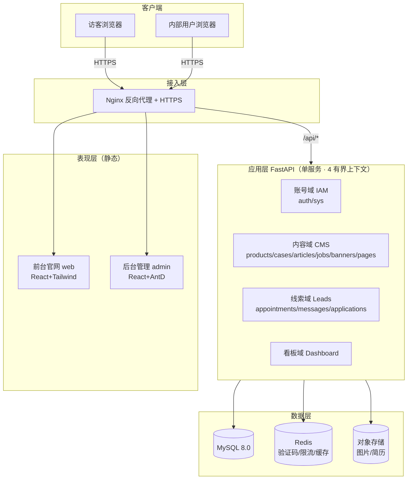
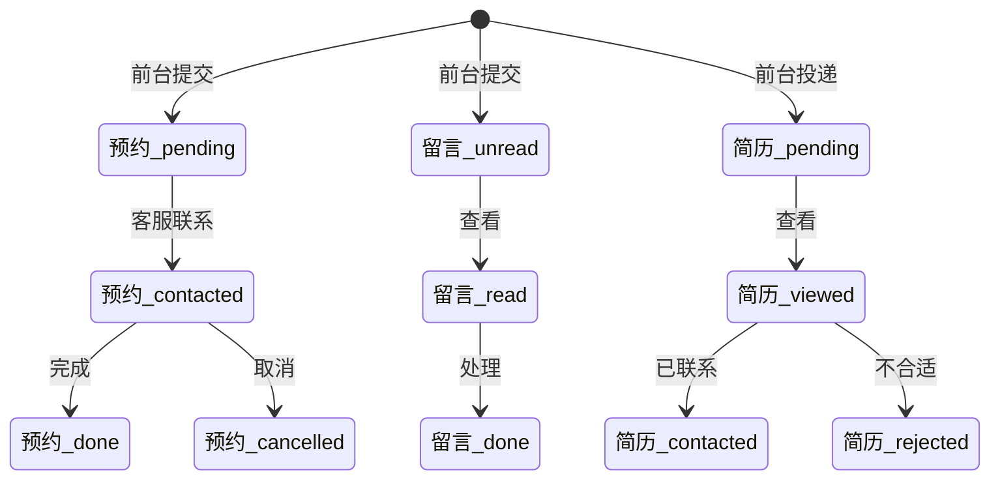

# TP 全屋家居 · 开发技术文档

> 文档版本：v1.4（技术实现基线）
> 基线依据：PRD v2.1、UI/UX 设计文档 v1.2（墨金令牌 + 后台布局与交互规范）、数据库设计文档 v2.3（20 表 schema，含 users.avatar）
> 修订说明：v1.4 按《项目开发实施方案》v1.2 确认结果，解除 §6.9 `users.avatar` 待办（数据库设计文档已升 v2.3 补充该字段），并同步基线版本。
> 视角：Software Architect（架构决策以 ADR 形式落地，详见 §1.4 / 附录）
> 平台：Web；前端 React（前台 + 后台双应用），后端 FastAPI；数据库 MySQL 8.0

## 目录

- [0. 阅读指南](#0-阅读指南)
- [1. 总体架构](#1-总体架构)
  - [1.1 系统拓扑](#1-1-系统拓扑)
  - [1.2 前后端分离与通信契约](#1-2-前后端分离与通信契约)
  - [1.3 部署形态](#1-3-部署形态)
  - [1.4 架构决策记录（ADR）](#1-4-架构决策记录adr)
- [2. 开发流程与工程规范](#2-开发流程与工程规范)
  - [2.1 仓库与分支策略](#2-1-仓库与分支策略)
  - [2.2 本地开发环境](#2-2-本地开发环境)
  - [2.3 编码规范](#2-3-编码规范)
  - [2.4 接口协作流程](#2-4-接口协作流程)
  - [2.5 测试与 CI](#2-5-测试与-ci)
  - [2.6 发布与回滚](#2-6-发布与回滚)
- [3. 前端工程规范](#3-前端工程规范)
  - [3.1 前台（React + Tailwind）](#3-1-前台react--tailwind)
  - [3.2 后台（React + Ant Design）](#3-2-后台react--ant-design)
  - [3.3 共用能力](#3-3-共用能力)
- [4. 后端工程规范](#4-后端工程规范)
  - [4.1 工程结构](#4-1-工程结构)
  - [4.2 依赖与中间件链](#4-2-依赖与中间件链)
  - [4.3 统一响应与异常](#4-3-统一响应与异常)
  - [4.4 文件上传服务](#4-4-文件上传服务)
  - [4.5 配置与密钥](#4-5-配置与密钥)
- [5. 数据库设计](#5-数据库设计)
  - [5.1 设计原则](#5-1-设计原则)
  - [5.2 E-R 图](#5-2-e-r-图)
  - [5.3 表结构清单（建表 SQL）](#5-3-表结构清单建表-sql)
  - [5.4 字典 / 配置表](#5-4-字典--配置表)
  - [5.5 迁移与种子数据](#5-5-迁移与种子数据)
- [6. 接口设计](#6-接口设计)
  - [6.1 通用约定](#6-1-通用约定)
  - [6.2 认证与账号（BR-1）](#6-2-认证与账号br-1)
  - [6.3 公开只读接口（FR-1~FR-6）](#6-3-公开只读接口fr-1fr-6)
  - [6.4 线索提交接口（FR-5.4 / 6.4.3 / 6.4.4）](#6-4-线索提交接口fr-5-4--6-4-3--6-4-4)
  - [6.5 内容管理接口（BR-2~BR-6）](#6-5-内容管理接口br-2br-6)
  - [6.6 线索管理接口（BR-7 / BR-8 / BR-5.2）](#6-6-线索管理接口br-7--br-8--br-5-2)
  - [6.7 数据看板接口（BR-9）](#6-7-数据看板接口br-9)
  - [6.8 系统管理接口（BR-10）](#6-8-系统管理接口br-10)
  - [6.9 文件上传接口](#6-9-文件上传接口)
- [7. 关键业务规则实现](#7-关键业务规则实现)
  - [7.1 线索流程状态机](#7-1-线索流程状态机)
  - [7.2 内容发布规则](#7-2-内容发布规则)
  - [7.3 权限规则](#7-3-权限规则)
  - [7.4 防刷与验证码](#7-4-防刷与验证码)
- [8. 安全与合规](#8-安全与合规)
  - [8.1 认证安全](#8-1-认证安全)
  - [8.2 输入与存储安全](#8-2-输入与存储安全)
  - [8.3 附件安全](#8-3-附件安全)
  - [8.4 合规（PIPL / ICP / 地图）](#8-4-合规pilp--icp--地图)
- [9. 性能、兼容性与可维护](#9-性能兼容性与可维护)
- [10. 部署与运维](#10-部署与运维)
  - [10.1 Docker Compose 编排](#10-1-docker-compose-编排)
  - [10.2 Nginx 配置](#10-2-nginx-配置)
  - [10.3 数据库与迁移上线](#10-3-数据库与迁移上线)
  - [10.4 环境变量清单](#10-4-环境变量清单)
- [附录 A. 接口总表](#附录-a-接口总表)
- [附录 B. 数据库表总表](#附录-b-数据库表总表)
- [附录 C. 错误码表](#附录-c-错误码表)
- [附录 D. PRD 编号 ↔ 接口 ↔ 表 三方对照](#附录-d-prd-编号--接口--表-三方对照)
- [附录 E. 角色权限接口映射](#附录-e-角色权限接口映射)

---

## 0. 阅读指南

| 项 | 说明 |
|----|------|
| 文档性质 | 开发技术文档（Technical Spec）：承接 PRD（做什么/规则）与 UI/UX（长什么样/怎么交互），回答"怎么落地"。 |
| 目标读者 | 前端工程师、后端工程师、DevOps、技术负责人、测试。 |
| 与 PRD 关系 | 章节/接口/表与 PRD 编号（FR/BR/NFR）逐条映射，见附录 D。 |
| 与 UI/UX 关系 | 前端令牌落地、组件形态以 UI/UX 文档 v1.2 为准（墨金令牌 `#1C1917`/`#B0894F`/`#FAFAF9`、后台内容区居中布局与间距刻度见其 §2.3/§4.1）。 |
| 本期边界 | 仅一期：纯展示官网 + 后台管理（不含在线交易 / SEO / 埋点 / 多语言）。 |
| 修订约定 | 本文档 v1.4 对齐 PRD v2.1 与数据库设计文档 v2.3；后续变更走 PRD 变更流程并同步本文档版本。 |

---

## 1. 总体架构

### 1.1 系统拓扑

系统由四层组成：**接入层（Nginx）→ 表现层（前台/后台静态资源）→ 应用层（FastAPI 单服务，内部分四有界上下文）→ 数据层（MySQL / Redis / 对象存储）**。前台与后台是两个独立的 React 应用，均通过 Nginx 反向代理访问同一套 FastAPI API。



> 说明：单 FastAPI 服务内部以 router 分包实现四个有界上下文（ADR-9），依赖方向单向（API → Data），上下文之间不直接循环依赖。

### 1.2 前后端分离与通信契约

- **统一前缀**：公开接口 `/api/public/...`；受保护接口 `/api/...`（Bearer Token + 权限依赖）。
- **传输**：HTTPS 全程；请求/响应 `Content-Type: application/json`（文件上传 `multipart/form-data`）。
- **鉴权头**：`Authorization: Bearer <access_token>`。
- **统一响应包装**（见 §4.3）：

```json
{ "code": 0, "message": "ok", "data": { }, "trace_id": "..." }
```

- **分页**：`GET /api/public/products?page=1&page_size=12&sort=sort,desc`，响应 `data.list` + `data.pagination{total,page,page_size,pages}`。
- **时间**：UTC 存储，接口返回 ISO-8601（`2026-08-18T10:00:00Z`），前端按本地时区展示。

### 1.3 部署形态

单体仓库（Monorepo）三个包：`web/`（前台）、`admin/`（后台）、`api/`（后端）。生产以 Docker 镜像交付，Nginx 承载静态资源与反向代理，FastAPI 通过 Uvicorn（多 worker）运行；MySQL / Redis / 对象存储为外部依赖（或同 Compose 编排）。详见 §10。

### 1.4 架构决策记录（ADR）

> 每项决策均"可回退 / 有代价"。下列为**推荐项（本文档已锁定）**；若后续评审需推翻，须在附录 D 标注差异并更新版本。

| ADR | 决策（已锁定） | 获得 | 代价 / 风险 | 备选 |
|-----|------|------|------|------|
| ADR-1 代码组织 | Monorepo 单仓（web/admin/api 三包） | 共享 TS 类型与工具、统一 CI、跨端复用令牌 | 单仓权限粒度粗 | 三独立仓库 |
| ADR-2 持久化 | MySQL 8.0 + SQLAlchemy 2.x + Alembic | 与 PRD 一致、迁移版本化、ORM 参数化防注入 | JSON 查询弱于 PG | PostgreSQL |
| ADR-3 鉴权 | Access+Refresh 双 Token（bcrypt，access 30min / refresh 7d） | 退出可控、refresh 可轮转 | 需 refresh 失效机制 | 单 Access Token |
| ADR-4 缓存/限流 | Redis | 验证码/限流/缓存一致、可水平扩展 | 多一依赖 | 进程内（一期可降级） |
| ADR-5 文件存储 | 抽象存储接口 + 本地(开发)/S3 兼容或 COS(生产) | 环境切换无侵入、隔离存储合规 | 需封装适配层 | 纯本地磁盘 |
| ADR-6 前端状态 | React Query（服务端态）+ Zustand（客户端态） | 状态分层清晰、请求缓存失效明确 | 需约定边界 | Redux Toolkit |
| ADR-7 后台组件 | Ant Design 5 + 墨金 theme 覆盖 | 成熟组件、仅换肤 | 覆盖深层 token、包体大 | 自研组件库 |
| ADR-8 接口契约 | OpenAPI First（FastAPI 自动 Swagger/ReDoc） | 前后端并行 Mock、单源真相 | 需纪律维持 schema 同步 | 手写文档 |
| ADR-9 边界上下文 | 内容/线索/账号/看板 四上下文，单 FastAPI 内 router 分包 | 域边界清晰、一期不 over-engineering | 依赖失控则回退大泥球 | 一期直接微服务 |

---

## 2. 开发流程与工程规范

### 2.1 仓库与分支策略

- **Monorepo**（ADR-1）目录：`/web`、`/admin`、`/api`、`/deploy`、`/docs`。
- **分支**：`main`（生产）、`release/x.y`（发布冻结）、`dev`（集成分支）、`feature/*`、`fix/*`。
- **提交规范**：`type(scope): subject`，type ∈ {feat, fix, refactor, docs, test, chore, perf}。
- **Code Review**：PR 需 ≥1 名后端/前端负责人 approve；受保护分支禁止直接 push。

### 2.2 本地开发环境

- **后端**：Python 3.11+，venv；`docker compose up -d mysql redis` 起依赖；`uvicorn api.main:app --reload`。
- **前台/后台**：Node 18+，`pnpm i`；`pnpm dev`（Vite，端口 5173 / 5174）；通过 Vite proxy 把 `/api` 代理到 `localhost:8000`，避免跨域。
- **统一**：`.env.example` 提交，真实密钥不入库；`make bootstrap` 一键初始化。

### 2.3 编码规范

- **Python**：PEP8、`ruff` 格式化 + `mypy` 类型检查；router 不含业务，service 纯逻辑、可单测；依赖注入做鉴权/权限/分页。
- **TypeScript**：ESLint + Prettier；`strict` 模式；组件按 `pages/components/hooks/services` 分层；`any` 禁用。
- **命名**：表/列蛇形；API 路径 kebab/小写；前端变量 camelCase；常量大写。

### 2.4 接口协作流程

1. 后端在 FastAPI 用 Pydantic 定义 schema（即 OpenAPI 源）。
2. `make openapi` 导出 `openapi.json`，前端用 `openapi-typescript` 生成 TS 类型。
3. 并行开发：前端以 `msw` 基于 OpenAPI 生成 Mock；联调期切真实 API（Vite proxy）。
4. 接口变更须先改 schema 并同步文档，禁止"文档与代码漂移"。

### 2.5 测试与 CI

- **后端**：`pytest`——单元测试（service）、接口测试（`httpx` + `TestClient`）；覆盖率 ≥70%，鉴权/权限/防刷路径必覆盖。
- **前端**：`vitest` 组件测试 + 关键 E2E（预约/简历提交链路）。
- **CI**：push 触发 lint + test + build；`main` 合并触发镜像构建与部署预览。

### 2.6 发布与回滚

- **版本化**：API 镜像 tag = `api:1.0.0`；数据库迁移 Alembic 顺序执行，迁移可向前（`downgrade`）回滚。
- **回滚**：镜像回退上一 tag；若涉及破坏性表变更，先执行对应 `downgrade` 再回退镜像。
- **冻结**：`release/*` 分支合并 `main` 即发布；发布窗口双人确认。

---

## 3. 前端工程规范

### 3.1 前台（React + Tailwind）

工程结构：

```
web/
  src/
    main.tsx, App.tsx
    router/            # React Router，懒加载页面
    pages/             # home/product/case/news/recruit/about/contact
    components/        # Button/Card/Tile/Tag/Banner/Tabs/Modal/Toast...
    hooks/             # useProducts/useCases/useAppointments(React Query)
    services/          # api client（axios/fetch 封装）
    theme/             # design-tokens.ts（墨金令牌）
    lib/               # format/captcha/validate
  tailwind.config.ts   # 注入墨金令牌
  index.html
```

**墨金令牌落地**（引 UI/UX §4.1）：`tailwind.config.ts` 扩展色板 `ink:#1C1917`、`gold:#B0894F`、`cream:#FAFAF9`；字体 `font-display: Cormorant/Noto Serif SC`、`font-body: Montserrat/Noto Sans SC`。主题令牌集中封装在 `theme/design-tokens.ts`，与后台共用（Monorepo 共享）。

```ts
// theme/design-tokens.ts（前台与后台共享）
export const tokens = {
  color: { ink: '#1C1917', gold: '#B0894F', cream: '#FAFAF9', inkSoft: '#211c17' },
  font: { display: "'Cormorant Garamond','Noto Serif SC',serif",
          body: "'Montserrat','Noto Sans SC',sans-serif' },
  radius: { sm: 6, md: 10, lg: 16 },
  shadow: { card: '0 6px 24px rgba(28,25,23,.08)' },
};
```

### 3.2 后台（React + Ant Design）

工程结构同前台，`src/theme/antdTheme.ts` 覆盖 Ant Design token：

```ts
// theme/antdTheme.ts（墨金 theme 覆盖，ADR-7）
import type { ThemeConfig } from 'antd';
export const antdGoldTheme: ThemeConfig = {
  token: {
    colorPrimary: '#1C1917',        // 主操作墨色
    colorInfo: '#B0894F',           // 强调香槟金
    colorLink: '#B0894F',
    borderRadius: 8,
    fontFamily: "'Montserrat','Noto Sans SC',sans-serif",
  },
  components: {
    Menu: { itemSelectedBg: 'rgba(176,137,79,.12)', itemSelectedColor: '#B0894F' },
    Layout: { siderBg: '#1C1917', headerBg: '#1C1917' },
  },
};
```

**RBAC 路由守卫**：登录后拉取 `GET /api/auth/menus` 得到菜单+按钮权限编码；路由表按权限动态注册，无权限路由不挂载；按钮级权限以 `<Auth code="product:edit">` 指令控制。

**后台布局（居中和谐，引 UI/UX §4.1）**：内容区 `Layout.Content` 在侧栏右侧区域内居中（`max-width:1320px; margin:0 auto; padding:28px 32px`），大屏左右留白对称；间距刻度按 UI/UX §2.3 后台间距表（卡片 24/28px、表格单元格 14/16px、操作链接 ≥10px、Tab 11/18px、输入框 36px 等），组件间距离舒展、不出现单侧大面积空白。

**后台交互实现（PRD v1.9 §7 通用约定）**：
- **编辑回填**：列表操作列「编辑」打开 `Modal` 编辑表单，`useForm` + `initialValues` 预填现有数据，保存 `PUT /api/cms/{resource}/{id}` 后 `invalidateQueries` 刷新列表并 `message.success` 提示；「+ 新增」保存 `POST` 后同样即时上列表。
- **状态行内切换**：`Table` 状态列渲染可点击 `Tag`（上架↔下架、发布↔下架、上线↔下线、启用↔禁用、招聘中↔已暂停），点击调用 `PUT /api/cms/{resource}/{id}/status`（或 `POST /{id}/publish|offline`），成功后本地更新 + Toast；账号状态走 `PUT /api/sys/accounts/{id}`（`is_activate` 字段，1 启用 / 0 禁用）。
- **上传选择文件**：上传区用 `<label>` + 隐藏 `<input type="file">`，点击触发本地文件选择器，选中后显示文件名与大小并预览（图片）；图片管理格点击直接替换；统一封装 `components/UploadFile`（复用 §4.4 白名单规则）。

### 3.3 共用能力

- `services/http.ts`：统一封装 `Authorization` 注入、401 刷新 refresh、错误 toast。
- `components/CaptchaField`：图形验证码 + 提交频率限制提示（FR-7.2）。
- `components/Toast`：统一反馈（成功/错误/警告）。
- 响应式断点：前台 `sm 640 / md 768 / lg 1024`（PC 优先兼顾移动）；后台仅桌面端（`lg 1024`）。

---


### 3.4 前台系统（web）模块结构图

前台官网为独立的 React 应用（Vite + TS + Tailwind），内部按「应用入口 → 页面 → 业务组件 → 数据层 → 基础设施」分层，通过 `services/http.ts` 调用后端公开接口 `/api/public/*`（详见 §6 公开只读接口）：


各层职责：L1 负责路由与懒加载；L2 为 7 个业务页面（与 PRD §5 导航一致）；L3 为墨金风格业务组件库；L4 用 React Query 管理服务端状态、统一封装 API 客户端；L5 沉淀设计令牌、工具与响应式断点。

### 3.5 后台系统（admin）模块结构图

后台管理系统为独立的 React 应用（Vite + TS + Ant Design 5，墨金 theme 覆盖），支持 RBAC 动态路由与按钮级权限：


各层职责：L1 按权限动态注册路由；L2 布局含「侧边菜单（按权限展开）+ 顶栏（用户/头像）」；L3 按 BR 分组（内容管理 / 线索管理 / 系统设置 / 数据看板）；L4 负责菜单权限拉取（`<Auth>` 指令）与客户端状态（zustand）；L5 封装带 401 刷新的 API 客户端与墨金主题。后台经 `/api/*`（Bearer Token + 权限依赖）与后端通信。

---

## 4. 后端工程规范

### 4.1 工程结构

```
api/
  main.py                 # FastAPI app + 中间件注册
  core/
    security.py           # bcrypt / JWT / 权限依赖
    config.py             # pydantic-settings
    response.py           # ApiResponse / ErrorCode / 异常
    limiter.py            # 限流
    storage.py            # 抽象存储接口
  routers/                # 按有界上下文分包
    auth.py  cms.py  leads.py  dashboard.py  sys.py  files.py
  services/               # 业务逻辑（纯函数/类，可单测）
  models/                 # SQLAlchemy ORM
  schemas/                # Pydantic 入参/出参
  deps/                   # DB session / 当前用户 / 权限依赖
  db/                     # engine / session / base
  alembic/                # 迁移
```

分层约束：**router 仅编排（解析→调 service→包装响应）**；service 含业务与事务；model 不依赖 schema；依赖注入 `get_current_user` / `require_perm(code)` 做鉴权与权限。

### 4.2 依赖与中间件链

请求顺序：`CORS → Access 日志 → JWT 解析（可选，公开接口跳过）→ 权限依赖（受保护接口）→ 限流 → XSS 过滤（富文本字段）→ 业务 → 操作日志（写操作）`。

- CORS：生产仅放行前台/后台域名。
- XSS 过滤：富文本（文章/页面/案例说明）落库前经 `bleach` 白名单清洗。
- 限流：基于 Redis，`@limiter.limit("5/minute", key_func=ip_or_phone)`（FR-7.2）。

### 4.3 统一响应与异常

```python
# core/response.py
from pydantic import BaseModel
from enum import IntEnum

class ErrCode(IntEnum):
    OK = 0
    UNAUTH = 1001
    FORBIDDEN = 1003
    VALIDATION = 2001
    NOT_FOUND = 2004
    RATE_LIMIT = 3001
    CAPTCHA = 3002
    FILE_TYPE = 4001
    FILE_SIZE = 4002
    SYS = 5000

def ok(data=None):
    return {"code": 0, "message": "ok", "data": data,
            "trace_id": ctx.get_trace_id()}

class BizError(Exception):
    def __init__(self, code: ErrCode, message: str): ...
```

所有异常经 `ExceptionMiddleware` 转为统一 `ApiResponse`，HTTP 状态与 `code` 分离（HTTP 200 承载业务码，鉴权失败用 401/403 由中间件兜底）。

### 4.4 文件上传服务

`core/storage.py` 定义抽象接口 `StorageBackend.upload(file, kind) -> url`，开发期 `LocalBackend`（写入 `uploads/`，Nginx 别名暴露），生产 `S3Backend`（MinIO / 腾讯云 COS）。统一入口 `POST /api/files/upload`：校验 MIME + 扩展名白名单 + 大小（图片 ≤2MB、简历 ≤10MB），服务端二次校验 magic bytes，存储路径带随机前缀隔离。

### 4.5 配置与密钥

`core/config.py` 用 `pydantic-settings` 读取环境变量：`DATABASE_URL`、`REDIS_URL`、`JWT_SECRET`、`JWT_ACCESS_TTL`、`JWT_REFRESH_TTL`、`STORAGE_KIND`、`OSS_*`、`CORS_ORIGINS`、`CAPTCHA_ENABLED`。**密钥不入库**，生产由环境变量 / 密钥管理服务注入。

---

## 5. 数据库设计

### 5.1 设计原则

- 字符集 `utf8mb4`、排序 `utf8mb4_0900_ai_ci`、引擎 InnoDB（对齐数据库设计文档 v2.2）。
- **通用字段体系（全表统一）**：`id BIGINT AUTO_INCREMENT PK`、`is_activate TINYINT(1)`（1 激活 / 0 禁用）、创建人 `created_at BIGINT`（用户 id）、创建时间 `created_date DATETIME`、修改人 `updated_at BIGINT`、修改时间 `updated_date DATETIME`。
- **删除语义**：无软删列（v2.2 起）；删除 = 禁用（`is_activate=0`）或物理删除。
- 外键带索引；枚举/状态用 `VARCHAR(20)` + 应用层常量（避免 MySQL ENUM 改造成本）。
- `JSON` 类型用于参数/图集/配置/权限等半结构化字段（MySQL 8.0 原生支持）。
- 写操作留痕统一走 `operation_logs`（不再依赖行级 `created_by` 审计列）。

### 5.2 E-R 图

实体关系（20 表，对齐数据库设计文档 v2.2）：User 多对一 Role / Department；Role 通过 `permissions(JSON)` 描述菜单+按钮权限；Product 多对一 Category（空间分类）；Case 多对多 Product（`case_products`）；Application 多对一 Job；三张线索表（Application/Appointment/Message）均通过 `processed_by` 多对一 User（处理人）。


> 上图为 E-R 图的渲染版（SVG，完整 **20 表**，按 组织域 / 内容域 / 线索域 分组）。实体矩形为主表，金色箭头线为关系（N:1 / 1:N / M:N），虚线金框为业务域分组。关系语义：USERS→ROLES(role_id)、USERS→DEPARTMENTS(dept_id)、DEPARTMENTS 自引用(parent_id)、USERS→OPERATION_LOGS(operator_id)、CATEGORIES→PRODUCTS(category_id)、PRODUCTS↔CASES 经 CASE_PRODUCTS(case_id/product_id)、JOBS→APPLICATIONS(job_id)、USERS→三张线索表(processed_by)。


### 5.3 表结构清单（建表 SQL）

> MySQL 8.0 / utf8mb4 / InnoDB。**完整 20 张表（含 COMMENT / 唯一键 / 索引 / CHECK 约束）见《数据库设计文档》v2.2 §4**；此处列出代表性表，展示通用字段体系与核心业务字段。

```sql
-- ===== 通用字段模板（所有表统一，v2.2）=====
-- id BIGINT AUTO_INCREMENT PRIMARY KEY                 # 主键
-- is_activate TINYINT(1) NOT NULL DEFAULT 1            # 1=激活 / 0=禁用
-- created_at BIGINT                                    # 创建人（用户 id）
-- created_date DATETIME NOT NULL DEFAULT CURRENT_TIMESTAMP          # 创建时间
-- updated_at BIGINT                                    # 修改人（用户 id）
-- updated_date DATETIME NOT NULL DEFAULT CURRENT_TIMESTAMP ON UPDATE CURRENT_TIMESTAMP  # 修改时间
-- 删除语义：禁用（is_activate=0）或物理删除（v2.2 起无软删列）

CREATE TABLE users (
  id BIGINT AUTO_INCREMENT PRIMARY KEY,
  username VARCHAR(64) NOT NULL COMMENT '用户名（登录名，唯一）',
  password_hash VARCHAR(255) NOT NULL COMMENT '登录密码(bcrypt)',
  real_name VARCHAR(64), nickname VARCHAR(64), phone VARCHAR(32), email VARCHAR(128),
  gender TINYINT NOT NULL DEFAULT 0 COMMENT '0未知/1男/2女', position VARCHAR(64),
  dept_id BIGINT COMMENT '部门编号', role_id BIGINT NOT NULL COMMENT '角色编号',
  last_login_at DATETIME COMMENT '最近登录时间', avatar VARCHAR(512) COMMENT '头像 URL',
  is_activate TINYINT(1) NOT NULL DEFAULT 1,
  created_at BIGINT, created_date DATETIME NOT NULL DEFAULT CURRENT_TIMESTAMP,
  updated_at BIGINT, updated_date DATETIME NOT NULL DEFAULT CURRENT_TIMESTAMP ON UPDATE CURRENT_TIMESTAMP,
  UNIQUE KEY uk_username (username),
  KEY idx_phone (phone), KEY idx_dept (dept_id), KEY idx_role (role_id)
) ENGINE=InnoDB DEFAULT CHARSET=utf8mb4 COLLATE=utf8mb4_0900_ai_ci COMMENT='用户';

CREATE TABLE departments (
  id BIGINT AUTO_INCREMENT PRIMARY KEY,
  name VARCHAR(64) NOT NULL COMMENT '部门名称',
  parent_id BIGINT NOT NULL DEFAULT 0 COMMENT '上级部门(0=顶级，自引用)',
  is_activate TINYINT(1) NOT NULL DEFAULT 1,
  created_at BIGINT, created_date DATETIME NOT NULL DEFAULT CURRENT_TIMESTAMP,
  updated_at BIGINT, updated_date DATETIME NOT NULL DEFAULT CURRENT_TIMESTAMP ON UPDATE CURRENT_TIMESTAMP,
  KEY idx_parent (parent_id)
) ENGINE=InnoDB DEFAULT CHARSET=utf8mb4 COLLATE=utf8mb4_0900_ai_ci COMMENT='部门';

CREATE TABLE roles (
  id BIGINT AUTO_INCREMENT PRIMARY KEY,
  name VARCHAR(64) NOT NULL COMMENT '角色名称',
  permissions JSON COMMENT '权限编码集合(RBAC)',
  is_activate TINYINT(1) NOT NULL DEFAULT 1,
  created_at BIGINT, created_date DATETIME NOT NULL DEFAULT CURRENT_TIMESTAMP,
  updated_at BIGINT, updated_date DATETIME NOT NULL DEFAULT CURRENT_TIMESTAMP ON UPDATE CURRENT_TIMESTAMP
) ENGINE=InnoDB DEFAULT CHARSET=utf8mb4 COLLATE=utf8mb4_0900_ai_ci COMMENT='角色';

CREATE TABLE categories (
  id BIGINT AUTO_INCREMENT PRIMARY KEY,
  name VARCHAR(64) NOT NULL COMMENT '空间分类（客厅/卧室/书房/餐厅/全屋）',
  sort INT NOT NULL DEFAULT 0,
  is_activate TINYINT(1) NOT NULL DEFAULT 1,
  created_at BIGINT, created_date DATETIME NOT NULL DEFAULT CURRENT_TIMESTAMP,
  updated_at BIGINT, updated_date DATETIME NOT NULL DEFAULT CURRENT_TIMESTAMP ON UPDATE CURRENT_TIMESTAMP,
  KEY idx_sort (sort)
) ENGINE=InnoDB DEFAULT CHARSET=utf8mb4 COLLATE=utf8mb4_0900_ai_ci COMMENT='空间分类';

CREATE TABLE products (
  id BIGINT AUTO_INCREMENT PRIMARY KEY,
  category_id BIGINT NOT NULL COMMENT '所属空间分类',
  series VARCHAR(64) NOT NULL COMMENT '所属系列（如：胡桃木）',
  product_code VARCHAR(64) NOT NULL COMMENT '产品编号',
  name VARCHAR(128) NOT NULL COMMENT '产品名',
  description LONGTEXT COMMENT '产品描述（富文本）', spec_params JSON, cover_image VARCHAR(512), gallery JSON,
  status VARCHAR(20) NOT NULL DEFAULT 'draft' COMMENT 'on上架/off下架/draft草稿',
  is_top TINYINT(1) NOT NULL DEFAULT 0, sort INT NOT NULL DEFAULT 0,
  is_activate TINYINT(1) NOT NULL DEFAULT 1,
  created_at BIGINT, created_date DATETIME NOT NULL DEFAULT CURRENT_TIMESTAMP,
  updated_at BIGINT, updated_date DATETIME NOT NULL DEFAULT CURRENT_TIMESTAMP ON UPDATE CURRENT_TIMESTAMP,
  UNIQUE KEY uk_product_code (product_code),
  KEY idx_category (category_id), KEY idx_series (series), KEY idx_status (status), KEY idx_sort (sort)
) ENGINE=InnoDB DEFAULT CHARSET=utf8mb4 COLLATE=utf8mb4_0900_ai_ci COMMENT='产品';

CREATE TABLE articles (
  id BIGINT AUTO_INCREMENT PRIMARY KEY,
  title VARCHAR(128) NOT NULL COMMENT '标题',
  category VARCHAR(20) NOT NULL COMMENT 'company企业新闻/industry行业资讯',
  cover_image VARCHAR(512), summary VARCHAR(500), body LONGTEXT COMMENT '正文（富文本 HTML）',
  source VARCHAR(128) COMMENT '来源（转载标注）',
  is_published TINYINT(1) NOT NULL DEFAULT 0 COMMENT '是否发布 0/1', is_top TINYINT(1) NOT NULL DEFAULT 0,
  publish_at DATETIME, expire_at DATETIME, author VARCHAR(64),
  is_activate TINYINT(1) NOT NULL DEFAULT 1,
  created_at BIGINT, created_date DATETIME NOT NULL DEFAULT CURRENT_TIMESTAMP,
  updated_at BIGINT, updated_date DATETIME NOT NULL DEFAULT CURRENT_TIMESTAMP ON UPDATE CURRENT_TIMESTAMP,
  KEY idx_category (category), KEY idx_publish (publish_at), KEY idx_published (is_published)
) ENGINE=InnoDB DEFAULT CHARSET=utf8mb4 COLLATE=utf8mb4_0900_ai_ci COMMENT='新闻';
```

> 其余 14 张表（cases / case_products / case_styles / jobs / applications / appointments / messages / banners / pages / site_config / announcements / reviews / service_steps / operation_logs）字段与建表语句见《数据库设计文档》v2.2 §3~§4。

### 5.4 字典 / 配置表

- `categories`（空间分类）：产品所属空间分类字典（客厅/卧室/书房/餐厅/全屋），`products.category_id` 数据源（BR-2.1）。
- `case_styles`（`type=style|space`）：案例风格/空间字典，供前台筛选（BR-3.2）。
- `site_config`（单行）：联系信息 + 预约时段选项，前台「联系我们」页与页脚共用（FR-6.4.1）。
- `announcements`：顶部公告条文案（FR-7.5）。
- `reviews` / `service_steps`：首页客户评价（FR-1.11）/ 服务流程（FR-1.10），后台维护（BR-6 页面内容）。
- `pages`：关于TP/发展历程/品牌介绍/联系我们富文本（`key` 枚举：about/history/brand/contact）。

### 5.5 迁移与种子数据

- **Alembic**：`alembic init` 后每个变更一个 revision；`alembic upgrade head` 上线，`downgrade -1` 回滚。
- **种子**：四个角色（超级管理员 / 内容编辑 / 客服 / 招聘专员，`roles.permissions` JSON，权限编码见附录 E）；初始超管账号 `admin`（`password_hash` bcrypt，部署时生成强密码，首次登录强制改密，BR-1.4）；`categories` 空间分类 5 行（客厅/卧室/书房/餐厅/全屋）。
- 默认 `site_config` 一条（id=1，地址/电话/邮箱/营业时间 `周一至周日 10:00–20:00`）；默认 `service_steps` 四条（预约咨询→上门量房→方案设计→一体化交付）。

---

## 6. 接口设计

### 6.1 通用约定

- Base URL：`/api`；公开 `/api/public`，受保护 `/api/*`（Bearer）。
- 鉴权：`Authorization: Bearer <access>`；refresh：`POST /api/auth/refresh`。
- 分页：`page`(从1)、`page_size`(默认12，上限50)、`sort=field,desc|asc`。
- 错误：见 §4.3 + 附录 C；频率限制返回 `code=3001` + `Retry-After`。
- 枚举（应用层常量）：product/case/article/job `status ∈ {off,on}`；appointment `status ∈ {pending,contacted,done,cancelled}`；message `status ∈ {unread,read,done}`；application `status ∈ {pending,viewed,contacted,rejected}`。

### 6.2 认证与账号（BR-1）

| 方法 | 路径 | 权限 | 说明 | PRD |
|------|------|------|------|-----|
| POST | /api/auth/login | 公开 | `username`+`password` 登录（校验 `is_activate=1` + bcrypt），返回 access+refresh | BR-1.1 |
| POST | /api/auth/logout | 登录 | 失效 refresh | BR-1.1 |
| POST | /api/auth/refresh | 公开(refresh) | 刷新 access | BR-1.3 |
| GET | /api/auth/me | 登录 | 当前用户 | BR-1.1 |
| GET | /api/auth/menus | 登录 | 菜单+按钮权限编码 | BR-1.2 |
| POST | /api/auth/change-password | 登录 | 改密（验原密码） | BR-1.4 |
| POST | /api/files/avatar | 登录 | 上传头像（≤2MB） | BR-1.4 |

登录示例：

```bash
curl -X POST /api/auth/login -H 'Content-Type: application/json' \
  -d '{"username":"admin","password":"******"}'
# => {"code":0,"data":{"access_token":"...","refresh_token":"...",
#      "user":{"id":1,"username":"admin","real_name":"系统管理员","role":"超级管理员","permissions":["*"]}}}
```

### 6.3 公开只读接口（FR-1~FR-6）

| 方法 | 路径 | 说明 | PRD |
|------|------|------|-----|
| GET | /api/public/banners | 首页轮播（启用且生效时间窗内） | FR-1.2 |
| GET | /api/public/products | 产品列表（分类/分页） | FR-2.2 |
| GET | /api/public/products/{id} | 产品详情（含关联） | FR-2.3 |
| GET | /api/public/categories | 产品系列 | FR-2.1 |
| GET | /api/public/cases | 案例列表（类型/风格/空间筛选） | FR-3.2/3.4 |
| GET | /api/public/cases/{id} | 案例详情 | FR-3.3 |
| GET | /api/public/articles | 新闻列表（分类） | FR-4.2 |
| GET | /api/public/articles/{id} | 新闻详情（含上下篇） | FR-4.3 |
| GET | /api/public/jobs | 职位列表 | FR-5.2 |
| GET | /api/public/jobs/{id} | 职位详情 | FR-5.3 |
| GET | /api/public/pages/{key} | 关于TP/历程/品牌/联系 | FR-6.1~6.4 |
| GET | /api/public/contact | 联系信息（site_config） | FR-6.4.1 |
| GET | /api/public/announcements | 公告条（生效中） | FR-7.5 |
| GET | /api/public/reviews | 客户评价 | FR-1.11 |
| GET | /api/public/service-steps | 服务流程 | FR-1.10 |

### 6.4 线索提交接口（FR-5.4 / 6.4.3 / 6.4.4）

| 方法 | 路径 | 说明 | PRD |
|------|------|------|-----|
| POST | /api/public/appointments | 在线预约（含验证码/限流） | FR-6.4.4 |
| POST | /api/public/messages | 在线留言 | FR-6.4.3 |
| POST | /api/public/applications | 简历投递（附件） | FR-5.4 |

预约提交示例（FR-7.2 防刷 + FR-7.3 隐私授权）：

```bash
curl -X POST /api/public/appointments -H 'Content-Type: application/json' \
  -d '{"name":"林女士","phone":"13800000000","appointment_date":"2026-08-20",
       "slot":"上午","captcha":"AB12","privacy_agreed":true}'
# => {"code":0,"message":"预约成功，工作人员将尽快与您联系","data":{"id":128}}
```

校验：手机号正则、日期 ≥ 今天、营业日、captcha 校验、隐私授权必 true；限流 5 次/分钟/IP。

### 6.5 内容管理接口（BR-2~BR-6）

统一 CRUD 风格（`/api/cms/{resource}`）：`GET /`(列表+搜索+分页) `GET /{id}` `POST /` `PUT /{id}` `DELETE /{id}` `POST /{id}/publish|offline`(上/下架) `POST /sort`。资源：`categories products cases articles jobs banners pages announcements reviews service-steps`。

**状态切换接口（PRD v2.1 行内切换）**：`PUT /api/cms/{resource}/{id}/status`，`body: { "status": "on" | "off" | "draft" | ... }`。**字段映射（对齐数据库设计文档 v2.2）**：products 有独立 `status`（draft 草稿 / off 下架 / on 上架）；articles 发布状态走 `is_published 0/1`（见 §7.2）；**cases / jobs / banners / announcements / reviews / service-steps 等无独立 status 列的资源，本端点映射通用 `is_activate`（`on`↔1 / `off`↔0，即上架/上线=启用，下架/下线=禁用）**；账号状态切换走 `PUT /api/sys/accounts/{id}`（`is_activate: 1|0`）。实现上等价于 `publish/offline` 的通用化，前端列表行内 Tag 点击调用本端点，返回新状态并写 `operation_logs`（action=`{resource}:status_change`）。

| 资源 | 权限编码示例 | PRD |
|------|------|-----|
| products | product:view/edit | BR-2 |
| cases | case:view/edit | BR-3 |
| articles | article:view/edit | BR-4 |
| jobs | job:view/edit | BR-5.1 |
| banners/pages/announce/reviews/steps | content:view/edit | BR-6 |

写操作触发 `operation_logs`（§7.3）。

### 6.6 线索管理接口（BR-7 / BR-8 / BR-5.2）

| 方法 | 路径 | 权限 | 说明 | PRD |
|------|------|------|------|-----|
| GET | /api/leads/appointments | cs/super | 预约列表（筛选/分页） | BR-7.1 |
| PUT | /api/leads/appointments/{id}/status | cs/super | 状态流转+备注 | BR-7.2 |
| GET | /api/leads/messages | cs/super | 留言列表 | BR-8.1 |
| PUT | /api/leads/messages/{id}/status | cs/super | 未读→已读→已处理 | BR-8.2 |
| GET | /api/leads/applications | recruiter/super | 简历列表 | BR-5.2 |
| GET | /api/leads/applications/{id} | recruiter/super | 详情+附件下载 URL | BR-5.2 |
| PUT | /api/leads/applications/{id}/status | recruiter/super | 待处理→已查看→已联系/不合适 | BR-5.2 |

> 数据维度隔离：客服仅见 appointment/message，招聘专员仅见 application，超管见全部（§8 角色权限）。

### 6.7 数据看板接口（BR-9）

| 方法 | 路径 | 权限 | 说明 | PRD |
|------|------|------|------|-----|
| GET | /api/dashboard/lead-stats?range=30d | 登录(角色维度) | 预约/留言/简历量 + 趋势 | BR-9.1/9.3 |
| GET | /api/dashboard/lead-list?type=appointment | 登录(角色维度) | 下钻明细 | BR-9.2 |

返回按角色过滤：客服看 appointment+message，招聘看 application，超管看全部；编辑无权限。

### 6.8 系统管理接口（BR-10）

| 方法 | 路径 | 权限 | 说明 | PRD |
|------|------|------|------|-----|
| GET/POST/PUT | /api/sys/accounts | super | 账号管理 | BR-10.1 |
| POST | /api/sys/accounts/{id}/reset-pwd | super | 重置密码 | BR-10.1 |
| GET/POST/PUT/DELETE | /api/sys/roles | super | 角色+权限配置 | BR-10.2 |
| GET | /api/sys/logs | super | 操作日志 | BR-10.3 |

### 6.9 文件上传接口

`POST /api/files/upload`（`multipart`，`file` + `kind=image|resume`）：校验白名单（image: jpg/png/webp ≤2MB；resume: pdf/doc/docx ≤10MB，magic bytes 二次校验），返回可访问 URL。头像走 `POST /api/files/avatar`（≤2MB，写入 `users.avatar`）。

> ✅ 已确认：`users.avatar`（头像 URL）为 BR-1.4 上传头像所需字段，已按《项目开发实施方案》v1.2 §10-② 确认补充至 users 表（`avatar VARCHAR(512) NULL`，见数据库设计文档 v2.3），本接口可直接启用。

---

## 7. 关键业务规则实现

### 7.1 线索流程状态机



- 初始状态：预约/简历 `pending`、留言 `unread`（PRD §10.1）。
- 状态流转仅限授权角色，且写 `operation_logs`（§7.3）。
- 看板统计各表原始条数（不去重）；北极星"有效线索"按手机号跨三类去重（PRD §12）。

### 7.2 内容发布规则

- **内容可见性（数据库设计文档 v2.2 §1.4）**：前台查询一律叠加 `is_activate=1`；产品另须 `status='on'`（上架）；新闻另须 `is_published=1` 且在发布窗内（`publish_at` 为空或 ≤ 当前时间，`expire_at` 为空或 ≥ 当前时间，到期自动不可见）；**案例 / 职位 / Banner / 公告 / 评价 / 流程步骤等无独立 status 列的表，前台可见条件即 `is_activate=1`（上架/上线），Banner 另须处于 `online_at`–`offline_at` 时间窗内**。下架/停用保留数据（禁用 `is_activate=0` 或物理删除，无软删列）。
- **状态切换**：`PUT /api/cms/{resource}/{id}/status` 为统一状态变更入口（products 支持 draft/off/on；articles 发布用 `is_published`），切换即时生效（前台展示实时反映），前端 Toast 反馈；状态变更写 `operation_logs`（§7.3），敏感状态（禁用账号）前端二次确认。
- 富文本（article.body / page.content / case.description / job.*）落库前 `bleach` 白名单清洗（标签+属性白名单），防 XSS（NFR-2）。
- 图片上传统一走 §4.4，校验类型/大小。

### 7.3 权限规则

- 无权限菜单不挂载（前台路由守卫）；后端每个受保护 router 经 `require_perm(code)`，无权限返回 `code=1003`。
- 敏感操作（删除、禁用账号、重置密码）二次确认 + 记日志（action=`delete/disable/reset_pwd`）。
- 日志内容：`operator_id/name, action, object_type, object_id, ip, created_at`。

### 7.4 防刷与验证码

- 图形验证码：服务端生成（随机串+噪点），答案存 Redis（60s TTL）；`captcha_id` + `captcha` 随表单提交校验（FR-7.2，默认启用，后台可关）。
- 频率限制：Redis 计数，维度 `ip` + `phone`，预约/留言/简历 `5/minute`，超限 `code=3001`。
- 隐私授权：`privacy_agreed=true` 为提交前置（FR-7.3 / NFR-3）。

---

## 8. 安全与合规

### 8.1 认证安全

- 密码 bcrypt（`salt+hash`，cost=12），不存明文；登录失败统一模糊报错。
- 双 Token：access 30min（无感刷新），refresh 7d；refresh 失效采用**服务端轮换 + 黑名单**（Redis SET，退出即加入）。
- HTTPS 全程；access 泄露窗口 ≤30min。

### 8.2 输入与存储安全

- 所有入参 Pydantic 校验；ORM 参数化查询（**禁止字符串拼接 SQL**，防注入）。
- 富文本 XSS 过滤（§7.2）；输出侧前台对不可信文本做转义。
- 统一异常不泄露堆栈；生产关 DEBUG。

### 8.3 附件安全

- 类型/大小白名单（§6.9）+ 服务端 magic bytes 二次校验 + 隔离存储路径（随机前缀）。
- 简历附件仅授权角色可下载（`/api/leads/applications/{id}` 返回带时效签名 URL）。
- 存储桶私有，禁止公开列举。

### 8.4 合规（PIPL / ICP / 地图）

- **PIPL**：表单点隐私告知+勾选授权（FR-7.3）；最小化收集（仅业务必要字段）；个人信息仅授权角色可见（§7.3 权限隔离+日志留痕）；留存期限在隐私政策声明，提供删除/更正通道（联系邮箱）。
- **ICP**：上线前完成备案，页脚展示备案号（FR-1.9）。
- **地图**：使用合规地图服务（如腾讯地图），坐标采用中国大陆标准地图，不使用未审图数据（NFR-3）。

---

## 9. 性能、兼容性与可维护

| 维度 | 指标 / 措施 | 映射 |
|------|------|------|
| 性能 | 接口 P95 ≤500ms；首页 P95 ≤3s；并发 ≥100；首页热点 Redis 缓存、列表分页、图片懒加载 | NFR-1 |
| 兼容 | 前台 Chrome/Edge/Safari + 移动端响应式；后台 Chrome/Edge 桌面 | NFR-4 |
| 易用 | 后台 AntD 规范 + 墨金主题；内容区居中布局（1320px）与间距刻度统一；编辑回填/状态切换/上传选文件交互齐全；操作反馈/错误提示 | NFR-5 |
| 可维护 | OpenAPI 自动文档 `/docs`；结构化日志 + trace_id；模块分层清晰 | NFR-6 |

---

## 10. 部署与运维

### 10.1 Docker Compose 编排

```yaml
# deploy/docker-compose.yml（节选）
services:
  web:    { build: ./web,  ports: ["8080:80"] }
  admin:  { build: ./admin, ports: ["8081:80"] }
  api:    { build: ./api,  ports: ["8000:8000"],
            environment: [DATABASE_URL, REDIS_URL, JWT_SECRET],
            depends_on: [mysql, redis] }
  mysql:  { image: mysql:8.0, environment: [MYSQL_ROOT_PASSWORD], volumes: ["./data/mysql:/var/lib/mysql"] }
  redis:  { image: redis:7, volumes: ["./data/redis:/data"] }
```

### 10.2 Nginx 配置

- 静态：`web/` → `site.tp-home.com`；`admin/` → `admin.tp-home.com`。
- 反向代理：`location /api/ { proxy_pass http://api:8000; }`，透传 `Authorization`。
- HTTPS：Let's Encrypt 证书；HSTS；静态资源 `Cache-Control` 长缓存 + 文件名 hash。

### 10.3 数据库与迁移上线

- 上线顺序：建库 → `alembic upgrade head` → 种子（`seed.sql`）→ 启动 api。
- 备份：每日 `mysqldump` 全量 + binlog 增量；迁移前先备份。
- 回滚：镜像回退 + 必要时 `alembic downgrade`。

### 10.4 环境变量清单

| 变量 | 说明 |
|------|------|
| DATABASE_URL | MySQL 连接串 |
| REDIS_URL | Redis 连接串 |
| JWT_SECRET | Token 签名密钥 |
| JWT_ACCESS_TTL / JWT_REFRESH_TTL | 30m / 7d |
| STORAGE_KIND | local / s3 |
| OSS_ENDPOINT / OSS_BUCKET / OSS_KEY / OSS_SECRET | 对象存储（生产） |
| CORS_ORIGINS | 前台/后台域名 |
| CAPTCHA_ENABLED | 默认 true |

---

## 附录 A. 接口总表

见 §6 各小节表格；汇总：`auth(7)` + `public(15)` + `leads(7)` + `cms(10资源×CRUD)` + `dashboard(2)` + `sys(6)` + `files(2)`。完整路径清单见 `deploy/openapi.json`（由 FastAPI 自动生成）。

## 附录 B. 数据库表总表

| 表 | 实体 | PRD |
|----|------|-----|
| users | 用户 | §9 |
| departments | 部门 | §9（需求新增） |
| roles | 角色 | §9 |
| categories | 空间分类 | §9 |
| products | 产品 | §9 |
| cases | 案例 | §9 |
| case_products | 案例-产品 m2m | §9 |
| case_styles | 风格/空间字典 | BR-3.2 |
| articles | 新闻 | §9 |
| jobs | 职位 | §9 |
| applications | 简历投递 | §9 |
| appointments | 预约 | §9 |
| messages | 留言 | §9 |
| banners | Banner | §9 |
| pages | 页面 | §9 |
| site_config | 联系/全局 | FR-6.4.1 |
| announcements | 公告条 | FR-7.5 |
| reviews | 客户评价 | FR-1.11 |
| service_steps | 服务流程 | FR-1.10 |
| operation_logs | 操作日志 | §9 |

## 附录 C. 错误码表

| code | 含义 | HTTP |
|------|------|------|
| 0 | 成功 | 200 |
| 1001 | 未认证 | 401 |
| 1003 | 无权限 | 403 |
| 2001 | 参数校验失败 | 200(业务码) |
| 2004 | 资源不存在 | 200 |
| 3001 | 频率限制 | 200(+Retry-After) |
| 3002 | 验证码错误 | 200 |
| 4001 | 文件类型不符 | 200 |
| 4002 | 文件过大 | 200 |
| 5000 | 系统错误 | 200/500 |

## 附录 D. PRD 编号 ↔ 接口 ↔ 表 三方对照

| PRD | 接口域 | 表 |
|-----|--------|----|
| FR-1.2/1.9/1.10/1.11 | public/banners, public/reviews, public/service-steps, contact | banners, reviews, service_steps, site_config |
| FR-2 | public/products, cms/products | products, categories |
| FR-3 | public/cases, cms/cases | cases, case_products, case_styles |
| FR-4 | public/articles, cms/articles | articles |
| FR-5 | public/jobs, cms/jobs, leads/applications | jobs, applications |
| FR-6.4 | public/contact, public/pages, cms/pages | site_config, pages |
| FR-7.2/7.3 | public/* 限流+验证码, files/upload | — |
| FR-7.5 | public/announcements, cms/announcements | announcements |
| BR-1 | auth/* | users, roles |
| BR-2~6 | cms/* | products/cases/articles/jobs/banners/pages/announcements/reviews/service_steps |
| BR-7/8/5.2 | leads/* | appointments, messages, applications |
| BR-9 | dashboard/* | 三线索表 |
| BR-10 | sys/* | users, departments, roles, operation_logs |

> 注：PRD v2.1 已移除 FR-7.6（前台登录入口）与 BR-1.5（返回前台），本文档不含对应跨端跳转端点；状态切换端点（`/api/cms/{resource}/{id}/status`、账号 `PUT /api/sys/accounts/{id}`）已并入 cms/sys 域（见 §6.5/§6.8）；表结构以数据库设计文档 v2.3 为准（20 表、通用字段体系，users 含 avatar）。

## 附录 E. 角色权限接口映射

| 权限编码 | 超管 | 编辑 | 客服 | 招聘 |
|----------|:---:|:---:|:---:|:---:|
| product:view/edit | ✅ | ✅ | — | — |
| case:view/edit | ✅ | ✅ | — | — |
| article:view/edit | ✅ | ✅ | — | — |
| job:view/edit | ✅ | ✅ | — | ✅ |
| content:view/edit (banner/page/announce/review/step) | ✅ | ✅ | — | — |
| leads:appointment (view/status) | ✅ | — | ✅ | — |
| leads:message (view/status) | ✅ | — | ✅ | — |
| leads:application (view/status) | ✅ | — | — | ✅ |
| dashboard:view | 全部 | — | appointment+message | application |
| sys:account/sys:role/sys:log | ✅ | — | — | — |

---

> 本文档 v1.4，对齐 PRD v2.1、UI/UX 设计文档 v1.2 与数据库设计文档 v2.3（20 表、通用字段体系，users 含 avatar）。架构决策（ADR-1~9）采用推荐项锁定；若评审需调整，须更新对应 ADR 与附录 D 并升版本。
