# TP 全屋家居 · 数据库设计文档

| 项目    | 内容                                                                                    |
| ----- | ------------------------------------------------------------------------------------- |
| 文档名称  | TP 全屋家居官网 + 后台管理系统 数据库设计文档                                                            |
| 文档版本  | v2.3                                                                                  |
| 文档状态  | 评审中                                                                                   |
| 编写日期  | 2026-08-19                                                                            |
| 品牌/产品 | TP 全屋家居                                                                               |
| 数据库   | MySQL 8.0（PRD 推荐，技术文档 ADR-2 已锁）                                                       |
| 依据资料  | PRD v1.9 + 开发技术文档 v1.1 + 需求更新（用户表/部门表/角色表 + 全表通用字段规范；产品表/新闻表业务字段重定义）+ 架构师组长审核修订（v2.2）+ 项目开发实施方案 v1.2 确认（v2.3，补 users.avatar） |

## 修订历史

| 版本   | 日期         | 修订人       | 修订说明                                                                                                                                                                                                                                                                                                                                                                                         |
| ---- | ---------- | --------- | -------------------------------------------------------------------------------------------------------------------------------------------------------------------------------------------------------------------------------------------------------------------------------------------------------------------------------------------------------------------------------------------- |
| v1.0 | 2026-08-18 | 架构通       | 初稿：19 表数据字典 + 建表 SQL + ER 图                                                                                                                                                                                                                                                                                                                                                                  |
| v1.1 | 2026-08-18 | 架构通（组长审核） | 补线索表处理人字段、site_config 单行约束、账号唯一键软删冲突修正                                                                                                                                                                                                                                                                                                                                                       |
| v2.0 | 2026-08-18 | 架构通（需求变更） | 按需求更新：① users 表重定义（用户名/姓名/昵称/手机号/邮箱/性别/岗位/部门编号/角色编号）；② 新增 departments 表（部门名称/上级部门 parent_id）；③ roles 表简化为角色名称；④ **所有表**统一通用字段：主键、`is_activate`（激活/禁用）、创建人`created_at`、创建时间`created_date`、修改人`updated_at`、修改时间`updated_date`（移除旧软删 deleted_at / 旧审计 created_by / 内容表独立 status）；⑤ 表数 19→20                                                                                                     |
| v2.1 | 2026-08-18 | 架构通（需求更新） | 按需求重定义 **products 产品表**（`category_id` 语义改为"空间分类"；新增 所属系列 `series`、产品编号 `product_code`(唯一)、发布状态 `status`(draft/off/on)、是否置顶 `is_top`、排序 `sort`；`params`→`spec_params`、`cover`→`cover_image`）与 **articles 新闻表**（新增 摘要 `summary`、来源 `source`、是否发布 `is_published`、截止时间 `expire_at`；`cover`→`cover_image`；分类取值 company/industry）；`categories` 语义同步改为"空间分类"                                        |
| v2.2 | 2026-08-18 | 架构通（组长审核） | 架构师组长严格审核修订：① users 补 `password_hash`/`last_login_at`（BR-1.1 登录鉴权无密码存储不可实现）；② roles 补 `permissions JSON`（BR-10.2 RBAC 权限配置）；③ §2.2 Mermaid 补 USERS→APPLICATIONS「处理」关系（原缺 applications）；④ §1.4 固化内容可见性规则（产品 `status='on'`、新闻发布窗 publish_at/expire_at）；⑤ products.series 加索引并建议后台字典化；⑥ reviews.rating 加 `CHECK(1–5)`；⑦ 种子补 categories 空间分类、角色权限、用户密码占位；⑧ 修正 departments.parent_id 空值表述与 SQL 一致 |
| v2.3 | 2026-08-19 | 架构通（方案确认） | 按《项目开发实施方案》v1.2 §10-② 确认：users 表补充 `avatar VARCHAR(512) NULL`（BR-1.4 个人中心上传头像，后台顶栏展示）；同步 §2.2 Mermaid、§3.1 数据字典与 §4 建表 SQL；表数 20 不变 |

## 目录

- [0. 阅读指南](#0-阅读指南)
- [1. 设计目标与原则](#1-设计目标与原则)
  - [1.1 命名与字符集](#11-命名与字符集)
  - [1.2 通用字段规范](#12-通用字段规范)
  - [1.3 类型约定](#13-类型约定)
  - [1.4 状态与枚举约定](#14-状态与枚举约定)
  - [1.5 索引与约束约定](#15-索引与约束约定)
- [2. ER 图](#2-er-图)
  - [2.1 完整 ER 图（SVG 渲染版）](#21-完整-er-图svg-渲染版)
  - [2.2 完整 ER 图（Mermaid）](#22-完整-er-图mermaid)
  - [2.3 关系说明](#23-关系说明)
- [3. 数据字典](#3-数据字典)
  - [3.1 组织域](#31-组织域)
  - [3.2 内容域](#32-内容域)
  - [3.3 线索域](#33-线索域)
- [4. 建表 SQL](#4-建表-sql)
- [5. 约束、索引与关系](#5-约束索引与关系)
  - [5.1 主键与外键](#51-主键与外键)
  - [5.2 唯一约束](#52-唯一约束)
  - [5.3 索引清单](#53-索引清单)
  - [5.4 多对多与层级结构](#54-多对多与层级结构)
- [6. 枚举与字典取值](#6-枚举与字典取值)
  - [6.1 状态枚举](#61-状态枚举)
  - [6.2 通用字典取值](#62-通用字典取值)
  - [6.3 JSON 字段结构示例](#63-json-字段结构示例)
- [7. 迁移与种子数据](#7-迁移与种子数据)
  - [7.1 Alembic 迁移](#71-alembic-迁移)
  - [7.2 种子数据](#72-种子数据)
- [8. 安全与合规](#8-安全与合规)
  - [8.1 敏感字段](#81-敏感字段)
  - [8.2 附件与存储路径](#82-附件与存储路径)
  - [8.3 PIPL 留存与删除](#83-pipl-留存与删除)
- [附录 A. 表清单总表](#附录-a-表清单总表)
- [附录 B. 字段类型对照](#附录-b-字段类型对照)
- [附录 C. PRD 编号 ↔ 表 对照表](#附录-c-prd-编号--表-对照表)

---

## 0. 阅读指南

| 项     | 说明                                                           |
| ----- | ------------------------------------------------------------ |
| 文档性质  | 数据库层完整落地设计：ER 图 + 数据字典 + 建表 SQL + 约束索引 + 迁移种子。               |
| 数据库基线 | MySQL 8.0 / utf8mb4 / InnoDB；ORM 为 SQLAlchemy 2.x + Alembic。 |
| 表规模   | **20 张**（组织域 4 + 内容域 13 + 线索域 3）。                            |
| 通用字段  | 全表统一：主键、`is_activate`、创建人/时间、修改人/时间（见 §1.2）。                 |

> **评审提示（架构师）**：本版按需求执行，以下三点建议评审确认——① 字段命名：需求指定 `created_at`=创建人、`created_date`=创建时间、`updated_at`=修改人、`updated_date`=修改时间（与常见约定 `created_by/created_at/updated_by/updated_at` 不同，仅命名差异，不影响结构）；② `users` 未含密码字段，登录鉴权需补 `password_hash`（bcrypt）；③ `roles` 仅含角色名称，RBAC 权限控制需补权限集合或独立权限表。

---

## 1. 设计目标与原则

### 1.1 命名与字符集

- 表名、字段名一律小写蛇形（snake_case）。
- 字符集 `utf8mb4`、排序 `utf8mb4_0900_ai_ci`、引擎 InnoDB。
- 表名统一复数；关联表语义化命名。

### 1.2 通用字段规范

> **所有表（20 张）统一包含以下字段**（数据字典各表不再重复列出）：

| 字段             | 类型                    | 空 | 默认                          | 说明           |
| -------------- | --------------------- | - | --------------------------- | ------------ |
| `id`           | BIGINT AUTO_INCREMENT | 否 | 自增                          | 主键           |
| `is_activate`  | TINYINT(1)            | 否 | 1                           | 状态：1=激活，0=禁用 |
| `created_at`   | BIGINT                | 是 | NULL                        | 创建人（用户 id）   |
| `created_date` | DATETIME              | 否 | CURRENT_TIMESTAMP           | 创建时间         |
| `updated_at`   | BIGINT                | 是 | NULL                        | 修改人（用户 id）   |
| `updated_date` | DATETIME              | 否 | CURRENT_TIMESTAMP ON UPDATE | 修改时间         |

> 说明：按需求命名（`created_at`=创建人、`created_date`=创建时间、`updated_at`=修改人、`updated_date`=修改时间）；v2.0 起**不再使用**软删 `deleted_at`（删除为物理删除或禁用 `is_activate=0`）与旧审计 `created_by`。

### 1.3 类型约定

| 场景       | 类型            | 说明                   |
| -------- | ------------- | -------------------- |
| 主键/外键/计数 | BIGINT        | 自增主键；外键同类型           |
| 短文本      | VARCHAR(n)    | 64/128/255/512       |
| 长文本      | LONGTEXT      | 富文本                  |
| 半结构化     | JSON          | MySQL 8.0 原生         |
| 时间点      | DATETIME      | UTC 存储               |
| 日期       | DATE          | 预约日期                 |
| 布尔/开关    | TINYINT(1)    | is_activate / is_top |
| 性别       | TINYINT       | 0=未知 1=男 2=女         |
| 金额（预留）   | DECIMAL(12,2) | 一期无交易                |

### 1.4 状态与枚举约定

- 通用激活状态用 `is_activate`（TINYINT 1/0），不用 VARCHAR 枚举。
- 业务状态机字段（线索 status）保留 `VARCHAR(20)` + 应用层常量。
- 内容**发布状态**与通用启用态并存：`products.status`（draft 草稿 / off 下架 / on 上架）、`articles.is_published`（0 未发布 / 1 已发布）；`is_activate` 表示记录是否启用，两者语义不同。
- **内容可见性规则**：前台查询一律叠加 `is_activate=1`；产品另须 `status='on'`（上架）；新闻另须 `is_published=1` 且在发布窗内（`publish_at` 为空或 ≤ 当前时间，`expire_at` 为空或 ≥ 当前时间，到期自动不可见）。

### 1.5 索引与约束约定

- 外键列建索引；高频查询/筛选/排序列建索引。
- 唯一约束：用户名唯一等（见 §5.2）。

---

## 2. ER 图

### 2.1 完整 ER 图（SVG 渲染版）

![TP 全屋家居 数据库 ER 图（完整 20 表）](data:image/svg+xml;base64,PHN2ZyB4bWxucz0iaHR0cDovL3d3dy53My5vcmcvMjAwMC9zdmciIHZpZXdCb3g9IjAgMCA2ODAgMzkyIiB3aWR0aD0iMTAwJSI+PHJlY3QgeD0iMCIgeT0iMCIgd2lkdGg9IjY4MCIgaGVpZ2h0PSIzOTIiIGZpbGw9IiNGRkZGRkYiLz48ZGVmcz48bWFya2VyIGlkPSJhcnJvdyIgdmlld0JveD0iMCAwIDEwIDEwIiByZWZYPSI4IiByZWZZPSI1IiBtYXJrZXJXaWR0aD0iNyIgbWFya2VySGVpZ2h0PSI3IiBvcmllbnQ9ImF1dG8tc3RhcnQtcmV2ZXJzZSI+PHBhdGggZD0iTTIgMUw4IDVMMiA5IiBmaWxsPSJub25lIiBzdHJva2U9ImNvbnRleHQtc3Ryb2tlIiBzdHJva2Utd2lkdGg9IjEuNSIgc3Ryb2tlLWxpbmVjYXA9InJvdW5kIiBzdHJva2UtbGluZWpvaW49InJvdW5kIi8+PC9tYXJrZXI+PC9kZWZzPjx0ZXh0IHg9IjQwIiB5PSIyNCIgZm9udC1zaXplPSIxNSIgZm9udC13ZWlnaHQ9IjUwMCIgZmlsbD0iIzFDMTkxNyIgZm9udC1mYW1pbHk9InNhbnMtc2VyaWYiPlRQIOWFqOWxi+WutuWxhSDCtyDmlbDmja7lupMgRVIg5Zu+77yI5a6M5pW0IDIwIOihqO+8iTwvdGV4dD48cmVjdCB4PSI0MCIgeT0iNTIiIHdpZHRoPSIxNTAiIGhlaWdodD0iMTgwIiByeD0iMTAiIGZpbGw9IiNGQUY5RjYiIHN0cm9rZT0iI0JBNzUxNyIgc3Ryb2tlLXdpZHRoPSIwLjUiIHN0cm9rZS1kYXNoYXJyYXk9IjUgMyIvPjx0ZXh0IHg9IjUyIiB5PSI2OCIgZm9udC1zaXplPSIxMiIgZm9udC13ZWlnaHQ9IjUwMCIgZmlsbD0iIzg1NEYwQiIgZm9udC1mYW1pbHk9InNhbnMtc2VyaWYiPue7hOe7h+WfnzwvdGV4dD48cmVjdCB4PSIyMDAiIHk9IjUyIiB3aWR0aD0iMzMwIiBoZWlnaHQ9IjI5MCIgcng9IjEwIiBmaWxsPSIjRkFGOUY2IiBzdHJva2U9IiNCQTc1MTciIHN0cm9rZS13aWR0aD0iMC41IiBzdHJva2UtZGFzaGFycmF5PSI1IDMiLz48dGV4dCB4PSIyMTIiIHk9IjY4IiBmb250LXNpemU9IjEyIiBmb250LXdlaWdodD0iNTAwIiBmaWxsPSIjODU0RjBCIiBmb250LWZhbWlseT0ic2Fucy1zZXJpZiI+5YaF5a655Z+fPC90ZXh0PjxyZWN0IHg9IjU0MCIgeT0iNTIiIHdpZHRoPSIxMDAiIGhlaWdodD0iMTM4IiByeD0iMTAiIGZpbGw9IiNGQUY5RjYiIHN0cm9rZT0iI0JBNzUxNyIgc3Ryb2tlLXdpZHRoPSIwLjUiIHN0cm9rZS1kYXNoYXJyYXk9IjUgMyIvPjx0ZXh0IHg9IjU0OCIgeT0iNjgiIGZvbnQtc2l6ZT0iMTIiIGZvbnQtd2VpZ2h0PSI1MDAiIGZpbGw9IiM4NTRGMEIiIGZvbnQtZmFtaWx5PSJzYW5zLXNlcmlmIj7nur/ntKLln588L3RleHQ+PHJlY3QgeD0iNTIiIHk9Ijc4IiB3aWR0aD0iMTE2IiBoZWlnaHQ9IjI4IiByeD0iNSIgZmlsbD0iI0ZGRkZGRiIgc3Ryb2tlPSIjMUMxOTE3IiBzdHJva2Utd2lkdGg9IjEiLz48dGV4dCB4PSIxMTAiIHk9Ijk2IiB0ZXh0LWFuY2hvcj0ibWlkZGxlIiBmb250LXNpemU9IjEyIiBmaWxsPSIjMUMxOTE3IiBmb250LWZhbWlseT0ic2Fucy1zZXJpZiI+dXNlcnM8L3RleHQ+PHJlY3QgeD0iNTIiIHk9IjExNiIgd2lkdGg9IjExNiIgaGVpZ2h0PSIyOCIgcng9IjUiIGZpbGw9IiNGRkZGRkYiIHN0cm9rZT0iIzFDMTkxNyIgc3Ryb2tlLXdpZHRoPSIxIi8+PHRleHQgeD0iMTEwIiB5PSIxMzQiIHRleHQtYW5jaG9yPSJtaWRkbGUiIGZvbnQtc2l6ZT0iMTIiIGZpbGw9IiMxQzE5MTciIGZvbnQtZmFtaWx5PSJzYW5zLXNlcmlmIj5yb2xlczwvdGV4dD48cmVjdCB4PSI1MiIgeT0iMTU0IiB3aWR0aD0iMTE2IiBoZWlnaHQ9IjI4IiByeD0iNSIgZmlsbD0iI0ZGRkZGRiIgc3Ryb2tlPSIjMUMxOTE3IiBzdHJva2Utd2lkdGg9IjEiLz48dGV4dCB4PSIxMTAiIHk9IjE3MiIgdGV4dC1hbmNob3I9Im1pZGRsZSIgZm9udC1zaXplPSIxMiIgZmlsbD0iIzFDMTkxNyIgZm9udC1mYW1pbHk9InNhbnMtc2VyaWYiPmRlcGFydG1lbnRzPC90ZXh0PjxyZWN0IHg9IjUyIiB5PSIxOTIiIHdpZHRoPSIxMTYiIGhlaWdodD0iMjgiIHJ4PSI1IiBmaWxsPSIjRkZGRkZGIiBzdHJva2U9IiMxQzE5MTciIHN0cm9rZS13aWR0aD0iMSIvPjx0ZXh0IHg9IjExMCIgeT0iMjEwIiB0ZXh0LWFuY2hvcj0ibWlkZGxlIiBmb250LXNpemU9IjEyIiBmaWxsPSIjMUMxOTE3IiBmb250LWZhbWlseT0ic2Fucy1zZXJpZiI+b3BlcmF0aW9uX2xvZ3M8L3RleHQ+PHJlY3QgeD0iMjEyIiB5PSI3OCIgd2lkdGg9IjEwMCIgaGVpZ2h0PSIyOCIgcng9IjUiIGZpbGw9IiNGRkZGRkYiIHN0cm9rZT0iIzFDMTkxNyIgc3Ryb2tlLXdpZHRoPSIxIi8+PHRleHQgeD0iMjYyIiB5PSI5NiIgdGV4dC1hbmNob3I9Im1pZGRsZSIgZm9udC1zaXplPSIxMiIgZmlsbD0iIzFDMTkxNyIgZm9udC1mYW1pbHk9InNhbnMtc2VyaWYiPmNhdGVnb3JpZXM8L3RleHQ+PHJlY3QgeD0iMjEyIiB5PSIxMTYiIHdpZHRoPSIxMDAiIGhlaWdodD0iMjgiIHJ4PSI1IiBmaWxsPSIjRkZGRkZGIiBzdHJva2U9IiMxQzE5MTciIHN0cm9rZS13aWR0aD0iMSIvPjx0ZXh0IHg9IjI2MiIgeT0iMTM0IiB0ZXh0LWFuY2hvcj0ibWlkZGxlIiBmb250LXNpemU9IjEyIiBmaWxsPSIjMUMxOTE3IiBmb250LWZhbWlseT0ic2Fucy1zZXJpZiI+cHJvZHVjdHM8L3RleHQ+PHJlY3QgeD0iMjEyIiB5PSIxNTQiIHdpZHRoPSIxMDAiIGhlaWdodD0iMjgiIHJ4PSI1IiBmaWxsPSIjRkZGRkZGIiBzdHJva2U9IiMxQzE5MTciIHN0cm9rZS13aWR0aD0iMSIvPjx0ZXh0IHg9IjI2MiIgeT0iMTcyIiB0ZXh0LWFuY2hvcj0ibWlkZGxlIiBmb250LXNpemU9IjEyIiBmaWxsPSIjMUMxOTE3IiBmb250LWZhbWlseT0ic2Fucy1zZXJpZiI+Y2FzZV9wcm9kdWN0czwvdGV4dD48cmVjdCB4PSIyMTIiIHk9IjE5MiIgd2lkdGg9IjEwMCIgaGVpZ2h0PSIyOCIgcng9IjUiIGZpbGw9IiNGRkZGRkYiIHN0cm9rZT0iIzFDMTkxNyIgc3Ryb2tlLXdpZHRoPSIxIi8+PHRleHQgeD0iMjYyIiB5PSIyMTAiIHRleHQtYW5jaG9yPSJtaWRkbGUiIGZvbnQtc2l6ZT0iMTIiIGZpbGw9IiMxQzE5MTciIGZvbnQtZmFtaWx5PSJzYW5zLXNlcmlmIj5jYXNlczwvdGV4dD48cmVjdCB4PSIyMTIiIHk9IjIzMCIgd2lkdGg9IjEwMCIgaGVpZ2h0PSIyOCIgcng9IjUiIGZpbGw9IiNGRkZGRkYiIHN0cm9rZT0iIzFDMTkxNyIgc3Ryb2tlLXdpZHRoPSIxIi8+PHRleHQgeD0iMjYyIiB5PSIyNDgiIHRleHQtYW5jaG9yPSJtaWRkbGUiIGZvbnQtc2l6ZT0iMTIiIGZpbGw9IiMxQzE5MTciIGZvbnQtZmFtaWx5PSJzYW5zLXNlcmlmIj5jYXNlX3N0eWxlczwvdGV4dD48cmVjdCB4PSIyMTIiIHk9IjI2OCIgd2lkdGg9IjEwMCIgaGVpZ2h0PSIyOCIgcng9IjUiIGZpbGw9IiNGRkZGRkYiIHN0cm9rZT0iIzFDMTkxNyIgc3Ryb2tlLXdpZHRoPSIxIi8+PHRleHQgeD0iMjYyIiB5PSIyODYiIHRleHQtYW5jaG9yPSJtaWRkbGUiIGZvbnQtc2l6ZT0iMTIiIGZpbGw9IiMxQzE5MTciIGZvbnQtZmFtaWx5PSJzYW5zLXNlcmlmIj5hcnRpY2xlczwvdGV4dD48cmVjdCB4PSIzMjgiIHk9Ijc4IiB3aWR0aD0iMTAwIiBoZWlnaHQ9IjI4IiByeD0iNSIgZmlsbD0iI0ZGRkZGRiIgc3Ryb2tlPSIjMUMxOTE3IiBzdHJva2Utd2lkdGg9IjEiLz48dGV4dCB4PSIzNzgiIHk9Ijk2IiB0ZXh0LWFuY2hvcj0ibWlkZGxlIiBmb250LXNpemU9IjEyIiBmaWxsPSIjMUMxOTE3IiBmb250LWZhbWlseT0ic2Fucy1zZXJpZiI+am9iczwvdGV4dD48cmVjdCB4PSIzMjgiIHk9IjExNiIgd2lkdGg9IjEwMCIgaGVpZ2h0PSIyOCIgcng9IjUiIGZpbGw9IiNGRkZGRkYiIHN0cm9rZT0iIzFDMTkxNyIgc3Ryb2tlLXdpZHRoPSIxIi8+PHRleHQgeD0iMzc4IiB5PSIxMzQiIHRleHQtYW5jaG9yPSJtaWRkbGUiIGZvbnQtc2l6ZT0iMTIiIGZpbGw9IiMxQzE5MTciIGZvbnQtZmFtaWx5PSJzYW5zLXNlcmlmIj5iYW5uZXJzPC90ZXh0PjxyZWN0IHg9IjMyOCIgeT0iMTU0IiB3aWR0aD0iMTAwIiBoZWlnaHQ9IjI4IiByeD0iNSIgZmlsbD0iI0ZGRkZGRiIgc3Ryb2tlPSIjMUMxOTE3IiBzdHJva2Utd2lkdGg9IjEiLz48dGV4dCB4PSIzNzgiIHk9IjE3MiIgdGV4dC1hbmNob3I9Im1pZGRsZSIgZm9udC1zaXplPSIxMiIgZmlsbD0iIzFDMTkxNyIgZm9udC1mYW1pbHk9InNhbnMtc2VyaWYiPnBhZ2VzPC90ZXh0PjxyZWN0IHg9IjMyOCIgeT0iMTkyIiB3aWR0aD0iMTAwIiBoZWlnaHQ9IjI4IiByeD0iNSIgZmlsbD0iI0ZGRkZGRiIgc3Ryb2tlPSIjMUMxOTE3IiBzdHJva2Utd2lkdGg9IjEiLz48dGV4dCB4PSIzNzgiIHk9IjIxMCIgdGV4dC1hbmNob3I9Im1pZGRsZSIgZm9udC1zaXplPSIxMiIgZmlsbD0iIzFDMTkxNyIgZm9udC1mYW1pbHk9InNhbnMtc2VyaWYiPnNpdGVfY29uZmlnPC90ZXh0PjxyZWN0IHg9IjMyOCIgeT0iMjMwIiB3aWR0aD0iMTAwIiBoZWlnaHQ9IjI4IiByeD0iNSIgZmlsbD0iI0ZGRkZGRiIgc3Ryb2tlPSIjMUMxOTE3IiBzdHJva2Utd2lkdGg9IjEiLz48dGV4dCB4PSIzNzgiIHk9IjI0OCIgdGV4dC1hbmNob3I9Im1pZGRsZSIgZm9udC1zaXplPSIxMiIgZmlsbD0iIzFDMTkxNyIgZm9udC1mYW1pbHk9InNhbnMtc2VyaWYiPmFubm91bmNlbWVudHM8L3RleHQ+PHJlY3QgeD0iMzI4IiB5PSIyNjgiIHdpZHRoPSIxMDAiIGhlaWdodD0iMjgiIHJ4PSI1IiBmaWxsPSIjRkZGRkZGIiBzdHJva2U9IiMxQzE5MTciIHN0cm9rZS13aWR0aD0iMSIvPjx0ZXh0IHg9IjM3OCIgeT0iMjg2IiB0ZXh0LWFuY2hvcj0ibWlkZGxlIiBmb250LXNpemU9IjEyIiBmaWxsPSIjMUMxOTE3IiBmb250LWZhbWlseT0ic2Fucy1zZXJpZiI+cmV2aWV3czwvdGV4dD48cmVjdCB4PSIzMjgiIHk9IjMwNiIgd2lkdGg9IjEwMCIgaGVpZ2h0PSIyOCIgcng9IjUiIGZpbGw9IiNGRkZGRkYiIHN0cm9rZT0iIzFDMTkxNyIgc3Ryb2tlLXdpZHRoPSIxIi8+PHRleHQgeD0iMzc4IiB5PSIzMjQiIHRleHQtYW5jaG9yPSJtaWRkbGUiIGZvbnQtc2l6ZT0iMTIiIGZpbGw9IiMxQzE5MTciIGZvbnQtZmFtaWx5PSJzYW5zLXNlcmlmIj5zZXJ2aWNlX3N0ZXBzPC90ZXh0PjxyZWN0IHg9IjU0OCIgeT0iNzgiIHdpZHRoPSI4NCIgaGVpZ2h0PSIyOCIgcng9IjUiIGZpbGw9IiNGRkZGRkYiIHN0cm9rZT0iIzFDMTkxNyIgc3Ryb2tlLXdpZHRoPSIxIi8+PHRleHQgeD0iNTkwIiB5PSI5NiIgdGV4dC1hbmNob3I9Im1pZGRsZSIgZm9udC1zaXplPSIxMiIgZmlsbD0iIzFDMTkxNyIgZm9udC1mYW1pbHk9InNhbnMtc2VyaWYiPmFwcGxpY2F0aW9uczwvdGV4dD48cmVjdCB4PSI1NDgiIHk9IjExNiIgd2lkdGg9Ijg0IiBoZWlnaHQ9IjI4IiByeD0iNSIgZmlsbD0iI0ZGRkZGRiIgc3Ryb2tlPSIjMUMxOTE3IiBzdHJva2Utd2lkdGg9IjEiLz48dGV4dCB4PSI1OTAiIHk9IjEzNCIgdGV4dC1hbmNob3I9Im1pZGRsZSIgZm9udC1zaXplPSIxMiIgZmlsbD0iIzFDMTkxNyIgZm9udC1mYW1pbHk9InNhbnMtc2VyaWYiPmFwcG9pbnRtZW50czwvdGV4dD48cmVjdCB4PSI1NDgiIHk9IjE1NCIgd2lkdGg9Ijg0IiBoZWlnaHQ9IjI4IiByeD0iNSIgZmlsbD0iI0ZGRkZGRiIgc3Ryb2tlPSIjMUMxOTE3IiBzdHJva2Utd2lkdGg9IjEiLz48dGV4dCB4PSI1OTAiIHk9IjE3MiIgdGV4dC1hbmNob3I9Im1pZGRsZSIgZm9udC1zaXplPSIxMiIgZmlsbD0iIzFDMTkxNyIgZm9udC1mYW1pbHk9InNhbnMtc2VyaWYiPm1lc3NhZ2VzPC90ZXh0PjxsaW5lIHgxPSIxMzAiIHkxPSIxMDYiIHgyPSIxMzAiIHkyPSIxMTQiIHN0cm9rZT0iI0IwODk0RiIgc3Ryb2tlLXdpZHRoPSIxLjUiIG1hcmtlci1lbmQ9InVybCgjYXJyb3cpIi8+PHRleHQgeD0iMTQwIiB5PSIxMTIiIGZvbnQtc2l6ZT0iMTAiIGZpbGw9IiM4NTRGMEIiIGZvbnQtZmFtaWx5PSJzYW5zLXNlcmlmIj5OOjE8L3RleHQ+PHBhdGggZD0iTTE2OCA5MiBMMTc2IDkyIEwxNzYgMTY4IEwxNjggMTY4IiBmaWxsPSJub25lIiBzdHJva2U9IiNCMDg5NEYiIHN0cm9rZS13aWR0aD0iMS41IiBtYXJrZXItZW5kPSJ1cmwoI2Fycm93KSIvPjx0ZXh0IHg9IjE1MCIgeT0iMTMyIiBmb250LXNpemU9IjEwIiBmaWxsPSIjODU0RjBCIiBmb250LWZhbWlseT0ic2Fucy1zZXJpZiI+MTpOPC90ZXh0PjxsaW5lIHgxPSIyNjIiIHkxPSIxMDYiIHgyPSIyNjIiIHkyPSIxMTQiIHN0cm9rZT0iI0IwODk0RiIgc3Ryb2tlLXdpZHRoPSIxLjUiIG1hcmtlci1lbmQ9InVybCgjYXJyb3cpIi8+PHRleHQgeD0iMjcyIiB5PSIxMTIiIGZvbnQtc2l6ZT0iMTAiIGZpbGw9IiM4NTRGMEIiIGZvbnQtZmFtaWx5PSJzYW5zLXNlcmlmIj4xOk48L3RleHQ+PGxpbmUgeDE9IjI2MiIgeTE9IjE0NCIgeDI9IjI2MiIgeTI9IjE1MiIgc3Ryb2tlPSIjQjA4OTRGIiBzdHJva2Utd2lkdGg9IjEuNSIgbWFya2VyLWVuZD0idXJsKCNhcnJvdykiLz48dGV4dCB4PSIyNzIiIHk9IjE1MCIgZm9udC1zaXplPSIxMCIgZmlsbD0iIzg1NEYwQiIgZm9udC1mYW1pbHk9InNhbnMtc2VyaWYiPk06TjwvdGV4dD48bGluZSB4MT0iMjYyIiB5MT0iMTgyIiB4Mj0iMjYyIiB5Mj0iMTkwIiBzdHJva2U9IiNCMDg5NEYiIHN0cm9rZS13aWR0aD0iMS41IiBtYXJrZXItZW5kPSJ1cmwoI2Fycm93KSIvPjx0ZXh0IHg9IjI3MiIgeT0iMTg4IiBmb250LXNpemU9IjEwIiBmaWxsPSIjODU0RjBCIiBmb250LWZhbWlseT0ic2Fucy1zZXJpZiI+MTpOPC90ZXh0PjxwYXRoIGQ9Ik00MjggOTIgTDU0OCA5MiIgZmlsbD0ibm9uZSIgc3Ryb2tlPSIjQjA4OTRGIiBzdHJva2Utd2lkdGg9IjEuNSIgbWFya2VyLWVuZD0idXJsKCNhcnJvdykiLz48dGV4dCB4PSI0ODIiIHk9Ijg2IiB0ZXh0LWFuY2hvcj0ibWlkZGxlIiBmb250LXNpemU9IjEwIiBmaWxsPSIjODU0RjBCIiBmb250LWZhbWlseT0ic2Fucy1zZXJpZiI+MTpOPC90ZXh0PjxyZWN0IHg9IjQwIiB5PSIzNTYiIHdpZHRoPSI2MDAiIGhlaWdodD0iMTYiIGZpbGw9IiNGQUY5RjYiLz48dGV4dCB4PSI0MCIgeT0iMzY3IiBmb250LXNpemU9IjExIiBmaWxsPSIjNUY1RTVBIiBmb250LWZhbWlseT0ic2Fucy1zZXJpZiI+55m95bqV5aKo6L6555+p5b2iPeaVsOaNruihqOOAgOmHkeiJsueureWktOe6vz3kuLvlpJbplK7lhbPns7vvvIhOOjEgLyAxOk4gLyBNOk7vvInjgIDomZrnur/ph5HmoYY95Lia5Yqh5Z+f5YiG57uEPC90ZXh0Pjx0ZXh0IHg9IjQwIiB5PSIzODUiIGZvbnQtc2l6ZT0iMTEiIGZpbGw9IiM1RjVFNUEiIGZvbnQtZmFtaWx5PSJzYW5zLXNlcmlmIj7lpJbplK7lrZfmrrXvvJp1c2Vycy5yb2xlX2lk4oaScm9sZXPjgIF1c2Vycy5kZXB0X2lk4oaSZGVwYXJ0bWVudHPjgIFwcm9kdWN0cy5jYXRlZ29yeV9pZOKGkmNhdGVnb3JpZXPjgIFjYXNlX3Byb2R1Y3RzKGNhc2VfaWQscHJvZHVjdF9pZCnjgIFhcHBsaWNhdGlvbnMuam9iX2lk4oaSam9ic+OAgee6v+e0ouihqCBwcm9jZXNzZWRfYnnihpJ1c2Vyc+OAgWRlcGFydG1lbnRzLnBhcmVudF9pZCDoh6rlvJXnlKg8L3RleHQ+PC9zdmc+)


> 上图为完整 **20 张表**的框线版 ER 图：白底墨边矩形 = 数据表、金色箭头线 = 主外键关系、虚线金框 = 业务域分组（组织域 / 内容域 / 线索域）。字段明细见 §3 数据字典。

### 2.2 完整 ER 图（Mermaid）

```mermaid
erDiagram
    ROLES ||--o{ USERS : "拥有 (N:1)"
    DEPARTMENTS ||--o{ USERS : "归属 (1:N)"
    DEPARTMENTS ||--o{ DEPARTMENTS : "层级 (1:N)"
    USERS ||--o{ OPERATION_LOGS : "产生 (1:N)"
    CATEGORIES ||--o{ PRODUCTS : "归类 (1:N)"
    PRODUCTS ||--o{ CASE_PRODUCTS : "关联 (1:N)"
    CASES ||--o{ CASE_PRODUCTS : "关联 (1:N)"
    JOBS ||--o{ APPLICATIONS : "招聘 (1:N)"
    USERS ||--o{ APPLICATIONS : "处理 (1:N)"
    USERS ||--o{ APPOINTMENTS : "处理 (1:N)"
    USERS ||--o{ MESSAGES : "处理 (1:N)"
    USERS {
    bigint id PK
    varchar username UK
    varchar password_hash
    varchar real_name
    varchar nickname
    varchar phone
    varchar email
    tinyint gender
    varchar position
    bigint dept_id FK
    bigint role_id FK
    datetime last_login_at
    varchar avatar
    tinyint is_activate
    bigint created_at
    datetime created_date
    bigint updated_at
    datetime updated_date
    }
    DEPARTMENTS {
    bigint id PK
    varchar name
    bigint parent_id FK
    tinyint is_activate
    bigint created_at
    datetime created_date
    bigint updated_at
    datetime updated_date
    }
    ROLES {
    bigint id PK
    varchar name
    json permissions
    tinyint is_activate
    bigint created_at
    datetime created_date
    bigint updated_at
    datetime updated_date
    }
    CATEGORIES {
    bigint id PK
    varchar name
    int sort
    tinyint is_activate
    bigint created_at
    datetime created_date
    bigint updated_at
    datetime updated_date
    }
    PRODUCTS {
    bigint id PK
    bigint category_id FK
    varchar series
    varchar product_code
    varchar name
    longtext description
    json spec_params
    varchar cover_image
    json gallery
    varchar status
    tinyint is_top
    int sort
    tinyint is_activate
    bigint created_at
    datetime created_date
    bigint updated_at
    datetime updated_date
    }
    CASES {
    bigint id PK
    varchar title
    varchar type
    varchar style
    varchar space
    varchar area
    varchar cover
    json gallery
    longtext background
    longtext description
    int sort
    tinyint is_activate
    bigint created_at
    datetime created_date
    bigint updated_at
    datetime updated_date
    }
    CASE_PRODUCTS {
    bigint case_id PK
    bigint product_id PK
    tinyint is_activate
    bigint created_at
    datetime created_date
    bigint updated_at
    datetime updated_date
    }
    CASE_STYLES {
    bigint id PK
    varchar name
    varchar type
    int sort
    tinyint is_activate
    bigint created_at
    datetime created_date
    bigint updated_at
    datetime updated_date
    }
    ARTICLES {
    bigint id PK
    varchar title
    varchar category
    varchar cover_image
    varchar summary
    longtext body
    varchar source
    tinyint is_published
    tinyint is_top
    datetime publish_at
    datetime expire_at
    varchar author
    tinyint is_activate
    bigint created_at
    datetime created_date
    bigint updated_at
    datetime updated_date
    }
    JOBS {
    bigint id PK
    varchar title
    varchar type
    varchar dept
    varchar location
    varchar salary
    longtext responsibility
    longtext requirement
    int sort
    tinyint is_activate
    bigint created_at
    datetime created_date
    bigint updated_at
    datetime updated_date
    }
    BANNERS {
    bigint id PK
    varchar image
    varchar title
    varchar subtitle
    varchar link
    int sort
    tinyint is_activate
    datetime online_at
    datetime offline_at
    bigint created_at
    datetime created_date
    bigint updated_at
    datetime updated_date
    }
    PAGES {
    bigint id PK
    varchar key UK
    varchar title
    longtext content
    tinyint is_activate
    bigint created_at
    datetime created_date
    bigint updated_at
    datetime updated_date
    }
    SITE_CONFIG {
    bigint id PK
    varchar address
    varchar phone
    varchar email
    varchar hours
    varchar map_coord
    json appointment_slots
    tinyint is_activate
    bigint created_at
    datetime created_date
    bigint updated_at
    datetime updated_date
    }
    ANNOUNCEMENTS {
    bigint id PK
    varchar content
    tinyint is_activate
    datetime online_at
    datetime offline_at
    int sort
    bigint created_at
    datetime created_date
    bigint updated_at
    datetime updated_date
    }
    REVIEWS {
    bigint id PK
    varchar avatar
    varchar name
    varchar city
    varchar house
    tinyint rating
    varchar content
    int sort
    tinyint is_activate
    bigint created_at
    datetime created_date
    bigint updated_at
    datetime updated_date
    }
    SERVICE_STEPS {
    bigint id PK
    int step_no
    varchar title
    varchar desc
    tinyint is_activate
    bigint created_at
    datetime created_date
    bigint updated_at
    datetime updated_date
    }
    APPLICATIONS {
    bigint id PK
    bigint job_id FK
    varchar name
    varchar phone
    varchar email
    varchar intro
    varchar attachment
    varchar school
    varchar education
    varchar major
    varchar grad_at
    int work_years
    varchar current_title
    varchar status
    bigint processed_by
    datetime processed_at
    tinyint is_activate
    bigint created_at
    datetime created_date
    bigint updated_at
    datetime updated_date
    }
    APPOINTMENTS {
    bigint id PK
    varchar name
    varchar phone
    date appointment_date
    varchar slot
    varchar note
    varchar status
    bigint processed_by
    datetime processed_at
    tinyint is_activate
    bigint created_at
    datetime created_date
    bigint updated_at
    datetime updated_date
    }
    MESSAGES {
    bigint id PK
    varchar name
    varchar contact
    varchar content
    varchar status
    bigint processed_by
    datetime processed_at
    tinyint is_activate
    bigint created_at
    datetime created_date
    bigint updated_at
    datetime updated_date
    }
    OPERATION_LOGS {
    bigint id PK
    bigint operator_id
    varchar operator_name
    varchar action
    varchar object_type
    bigint object_id
    varchar detail
    varchar ip
    tinyint is_activate
    bigint created_at
    datetime created_date
    bigint updated_at
    datetime updated_date
    }
```



### 2.3 关系说明

| 关系                                         | 基数    | 实现                                        |
| ------------------------------------------ | ----- | ----------------------------------------- |
| roles → users                              | 1 : N | `users.role_id` → `roles.id`              |
| departments → users                        | 1 : N | `users.dept_id` → `departments.id`        |
| departments → departments                  | 1 : N | `departments.parent_id` 自引用（0=顶级）         |
| users → operation_logs                     | 1 : N | `operation_logs.operator_id` → `users.id` |
| categories → products                      | 1 : N | `products.category_id` → `categories.id`  |
| products ↔ cases                           | M : N | 经 `case_products(case_id, product_id)`    |
| jobs → applications                        | 1 : N | `applications.job_id` → `jobs.id`         |
| users → applications/appointments/messages | 1 : N | `processed_by` → `users.id`               |

> 外键采用逻辑外键 + 索引策略；删除语义：业务数据禁用（`is_activate=0`），组织/账号数据硬删或禁用。

---

## 3. 数据字典

> 通用字段（`id`、`is_activate`、`created_at`/`created_date`/`updated_at`/`updated_date`）全表统一，见 §1.2，各表不重复列出；下表中"业务字段"为各表独有列。

### 3.1 组织域

**users（用户）** — 业务字段

| 字段            | 类型           | 空 | 默认   | 键/索引                   | 说明                  |
| ------------- | ------------ | - | ---- | ---------------------- | ------------------- |
| username      | VARCHAR(64)  | 否 | —    | UK                     | 用户名（登录名，唯一）         |
| real_name     | VARCHAR(64)  | 是 | NULL | —                      | 姓名                  |
| nickname      | VARCHAR(64)  | 是 | NULL | —                      | 昵称                  |
| phone         | VARCHAR(32)  | 是 | NULL | idx                    | 手机号                 |
| email         | VARCHAR(128) | 是 | NULL | —                      | 邮箱                  |
| gender        | TINYINT      | 是 | 0    | —                      | 性别：0 未知/1 男/2 女     |
| position      | VARCHAR(64)  | 是 | NULL | —                      | 岗位                  |
| dept_id       | BIGINT       | 是 | NULL | FK→departments.id, idx | 部门编号                |
| role_id       | BIGINT       | 否 | —    | FK→roles.id, idx       | 角色编号                |
| password_hash | VARCHAR(255) | 否 | —    | —                      | 登录密码（bcrypt，BR-1.1） |
| last_login_at | DATETIME     | 是 | NULL | —                      | 最近登录时间              |
| avatar        | VARCHAR(512) | 是 | NULL | —                      | 头像 URL（BR-1.4 个人中心上传，后台顶栏展示） |

> 审核修订（v2.2）：需求未含密码字段，但 PRD BR-1.1 登录鉴权必须有密码存储，已补 `password_hash`（bcrypt）与 `last_login_at`。
> 补充（v2.3）：按《项目开发实施方案》v1.2 确认，补 `avatar`（BR-1.4 上传头像）。

**departments（部门）** — 业务字段

| 字段        | 类型          | 空 | 默认 | 键/索引    | 说明                              |
| --------- | ----------- | - | -- | ------- | ------------------------------- |
| name      | VARCHAR(64) | 否 | —  | —       | 部门名称                            |
| parent_id | BIGINT      | 否 | 0  | 自引用 idx | 上级部门（0 = 顶级，NOT NULL DEFAULT 0） |

**roles（角色）** — 业务字段

| 字段          | 类型          | 空 | 默认   | 键/索引 | 说明                                     |
| ----------- | ----------- | - | ---- | ---- | -------------------------------------- |
| name        | VARCHAR(64) | 否 | —    | —    | 角色名称                                   |
| permissions | JSON        | 是 | NULL | —    | 权限编码集合（RBAC，BR-10.2；如 `["content:*"]`） |

> 审核修订（v2.2）：需求仅含角色名称，但 PRD BR-10.2 角色权限配置无法落地，已补 `permissions JSON`（最小侵入方案，不新增权限表）。

**operation_logs（操作日志）** — 业务字段

| 字段            | 类型            | 空 | 默认   | 键/索引 | 说明                  |
| ------------- | ------------- | - | ---- | ---- | ------------------- |
| operator_id   | BIGINT        | 是 | NULL | idx  | 操作人 id（FK→users.id） |
| operator_name | VARCHAR(64)   | 是 | NULL | —    | 操作人名称（冗余）           |
| action        | VARCHAR(64)   | 否 | —    | idx  | 动作编码                |
| object_type   | VARCHAR(64)   | 是 | NULL | —    | 对象类型                |
| object_id     | BIGINT        | 是 | NULL | —    | 对象 id               |
| detail        | VARCHAR(1024) | 是 | NULL | —    | 详情                  |
| ip            | VARCHAR(64)   | 是 | NULL | —    | 来源 IP               |

### 3.2 内容域

**categories（空间分类）** — 业务字段

| 字段   | 类型          | 空 | 默认 | 键/索引 | 说明                            |
| ---- | ----------- | - | -- | ---- | ----------------------------- |
| name | VARCHAR(64) | 否 | —  | —    | 空间分类名（客厅 / 卧室 / 书房 / 餐厅 / 全屋） |
| sort | INT         | 否 | 0  | idx  | 排序值                           |

**products（产品）** — 业务字段

| 字段           | 类型           | 空 | 默认      | 键/索引                  | 说明                             |
| ------------ | ------------ | - | ------- | --------------------- | ------------------------------ |
| category_id  | BIGINT       | 否 | —       | FK→categories.id, idx | 所属空间分类                         |
| series       | VARCHAR(64)  | 否 | —       | idx                   | 所属系列（如：胡桃木；建议后台字典化维护，保证筛选一致）   |
| product_code | VARCHAR(64)  | 否 | —       | uk                    | 产品编号（唯一）                       |
| name         | VARCHAR(128) | 否 | —       | —                     | 产品名                            |
| description  | LONGTEXT     | 是 | NULL    | —                     | 产品描述（富文本）                      |
| spec_params  | JSON         | 是 | NULL    | —                     | 规格参数（JSON 串）                   |
| cover_image  | VARCHAR(512) | 是 | NULL    | —                     | 封面图片 URL                       |
| gallery      | JSON         | 是 | NULL    | —                     | 其它图片 URL（JSON 串）               |
| status       | VARCHAR(20)  | 否 | 'draft' | idx                   | 发布状态：on 上架 / off 下架 / draft 草稿 |
| is_top       | TINYINT(1)   | 否 | 0       | —                     | 是否置顶 0/1                       |
| sort         | INT          | 否 | 0       | idx                   | 排序值                            |

**cases（案例）** — 业务字段

| 字段          | 类型           | 空 | 默认   | 键/索引 | 说明        |
| ----------- | ------------ | - | ---- | ---- | --------- |
| title       | VARCHAR(128) | 否 | —    | —    | 标题        |
| type        | VARCHAR(20)  | 否 | —    | idx  | 客户实景/设计方案 |
| style       | VARCHAR(32)  | 是 | NULL | —    | 风格        |
| space       | VARCHAR(32)  | 是 | NULL | —    | 空间        |
| area        | VARCHAR(32)  | 是 | NULL | —    | 面积        |
| cover       | VARCHAR(512) | 是 | NULL | —    | 封面        |
| gallery     | JSON         | 是 | NULL | —    | 图集        |
| background  | LONGTEXT     | 是 | NULL | —    | 项目背景      |
| description | LONGTEXT     | 是 | NULL | —    | 设计说明      |
| sort        | INT          | 否 | 0    | idx  | 排序值       |

**case_products（案例-产品关联）** — 业务字段

| 字段         | 类型     | 空 | 默认 | 键/索引                    | 说明    |
| ---------- | ------ | - | -- | ----------------------- | ----- |
| case_id    | BIGINT | 否 | —  | PK, FK→cases.id         | 案例 id |
| product_id | BIGINT | 否 | —  | PK, FK→products.id, idx | 产品 id |

**case_styles（风格/空间字典）** — 业务字段

| 字段   | 类型          | 空 | 默认 | 键/索引 | 说明            |
| ---- | ----------- | - | -- | ---- | ------------- |
| name | VARCHAR(64) | 否 | —  | —    | 字典值           |
| type | VARCHAR(20) | 否 | —  | idx  | style 或 space |
| sort | INT         | 否 | 0  | —    | 排序值           |

**articles（新闻）** — 业务字段

| 字段           | 类型           | 空 | 默认   | 键/索引 | 说明                              |
| ------------ | ------------ | - | ---- | ---- | ------------------------------- |
| title        | VARCHAR(128) | 否 | —    | —    | 标题                              |
| category     | VARCHAR(20)  | 否 | —    | idx  | 分类：company 企业新闻 / industry 行业资讯 |
| cover_image  | VARCHAR(512) | 是 | NULL | —    | 封面图 URL                         |
| summary      | VARCHAR(500) | 是 | NULL | —    | 摘要                              |
| body         | LONGTEXT     | 是 | NULL | —    | 正文（富文本 HTML）                    |
| source       | VARCHAR(128) | 是 | NULL | —    | 来源（转载标注）                        |
| is_published | TINYINT(1)   | 否 | 0    | idx  | 是否发布 0/1                        |
| is_top       | TINYINT(1)   | 否 | 0    | —    | 是否置顶/推荐 0/1                     |
| publish_at   | DATETIME     | 是 | NULL | idx  | 发布时间                            |
| expire_at    | DATETIME     | 是 | NULL | —    | 截止时间                            |
| author       | VARCHAR(64)  | 是 | NULL | —    | 作者（保留，BR-4 列表展示）                |

**jobs（职位）** — 业务字段

| 字段             | 类型           | 空 | 默认   | 键/索引 | 说明        |
| -------------- | ------------ | - | ---- | ---- | --------- |
| title          | VARCHAR(128) | 否 | —    | —    | 职位名       |
| type           | VARCHAR(20)  | 否 | —    | idx  | 社会招聘/校园招聘 |
| dept           | VARCHAR(64)  | 是 | NULL | —    | 部门        |
| location       | VARCHAR(64)  | 是 | NULL | —    | 地点        |
| salary         | VARCHAR(64)  | 是 | NULL | —    | 薪资范围      |
| responsibility | LONGTEXT     | 是 | NULL | —    | 岗位职责      |
| requirement    | LONGTEXT     | 是 | NULL | —    | 任职要求      |
| sort           | INT          | 否 | 0    | idx  | 排序值       |

**banners（Banner）** — 业务字段

| 字段         | 类型           | 空 | 默认   | 键/索引 | 说明     |
| ---------- | ------------ | - | ---- | ---- | ------ |
| image      | VARCHAR(512) | 否 | —    | —    | 图片 URL |
| title      | VARCHAR(128) | 是 | NULL | —    | 标题     |
| subtitle   | VARCHAR(255) | 是 | NULL | —    | 副标题    |
| link       | VARCHAR(512) | 是 | NULL | —    | 跳转链接   |
| sort       | INT          | 否 | 0    | idx  | 排序值    |
| online_at  | DATETIME     | 是 | NULL | —    | 生效时间   |
| offline_at | DATETIME     | 是 | NULL | —    | 失效时间   |

**pages（页面内容）** — 业务字段

| 字段      | 类型           | 空 | 默认   | 键/索引 | 说明                                |
| ------- | ------------ | - | ---- | ---- | --------------------------------- |
| key     | VARCHAR(32)  | 否 | —    | UK   | 页面标识（about/history/brand/contact） |
| title   | VARCHAR(128) | 是 | NULL | —    | 页面标题                              |
| content | LONGTEXT     | 是 | NULL | —    | 富文本内容                             |

**site_config（站点配置，单行）** — 业务字段

| 字段                | 类型           | 空 | 默认    | 键/索引            | 说明               |
| ----------------- | ------------ | - | ----- | --------------- | ---------------- |
| id                | BIGINT       | 否 | 1（固定） | PK, CHECK(id=1) | 主键（固定 id=1，单行约束） |
| address           | VARCHAR(255) | 是 | NULL  | —               | 体验中心地址           |
| phone             | VARCHAR(64)  | 是 | NULL  | —               | 客服电话             |
| email             | VARCHAR(128) | 是 | NULL  | —               | 联系邮箱             |
| hours             | VARCHAR(64)  | 是 | NULL  | —               | 营业时间             |
| map_coord         | VARCHAR(64)  | 是 | NULL  | —               | 地图坐标             |
| appointment_slots | JSON         | 是 | NULL  | —               | 预约时段选项           |

**announcements（公告条）** — 业务字段

| 字段         | 类型           | 空 | 默认   | 键/索引 | 说明   |
| ---------- | ------------ | - | ---- | ---- | ---- |
| content    | VARCHAR(512) | 否 | —    | —    | 公告文案 |
| online_at  | DATETIME     | 是 | NULL | —    | 生效时间 |
| offline_at | DATETIME     | 是 | NULL | —    | 失效时间 |
| sort       | INT          | 否 | 0    | —    | 排序值  |

**reviews（客户评价）** — 业务字段

| 字段      | 类型           | 空 | 默认   | 键/索引 | 说明     |
| ------- | ------------ | - | ---- | ---- | ------ |
| avatar  | VARCHAR(512) | 是 | NULL | —    | 头像 URL |
| name    | VARCHAR(64)  | 否 | —    | —    | 客户姓名   |
| city    | VARCHAR(64)  | 是 | NULL | —    | 城市     |
| house   | VARCHAR(64)  | 是 | NULL | —    | 户型     |
| rating  | TINYINT      | 否 | 5    | —    | 评分 1–5 |
| content | VARCHAR(512) | 是 | NULL | —    | 评价内容   |
| sort    | INT          | 否 | 0    | —    | 排序值    |

**service_steps（服务流程）** — 业务字段

| 字段      | 类型           | 空 | 默认   | 键/索引 | 说明       |
| ------- | ------------ | - | ---- | ---- | -------- |
| step_no | INT          | 否 | —    | —    | 步骤序号 1–4 |
| title   | VARCHAR(64)  | 否 | —    | —    | 步骤标题     |
| desc    | VARCHAR(512) | 是 | NULL | —    | 步骤说明     |

### 3.3 线索域

**applications（简历投递）** — 业务字段

| 字段            | 类型            | 空 | 默认        | 键/索引            | 说明                                     |
| ------------- | ------------- | - | --------- | --------------- | -------------------------------------- |
| job_id        | BIGINT        | 否 | —         | FK→jobs.id, idx | 应聘职位                                   |
| name          | VARCHAR(64)   | 否 | —         | —               | 姓名                                     |
| phone         | VARCHAR(32)   | 否 | —         | idx             | 手机号                                    |
| email         | VARCHAR(128)  | 是 | NULL      | —               | 邮箱                                     |
| intro         | VARCHAR(1024) | 是 | NULL      | —               | 个人简介                                   |
| attachment    | VARCHAR(512)  | 是 | NULL      | —               | 简历附件 URL                               |
| school        | VARCHAR(128)  | 是 | NULL      | —               | 学校（校招）                                 |
| education     | VARCHAR(32)   | 是 | NULL      | —               | 学历（校招）                                 |
| major         | VARCHAR(128)  | 是 | NULL      | —               | 专业（校招）                                 |
| grad_at       | VARCHAR(32)   | 是 | NULL      | —               | 毕业时间（校招）                               |
| work_years    | INT           | 是 | NULL      | —               | 工作年限（社招）                               |
| current_title | VARCHAR(64)   | 是 | NULL      | —               | 当前职位（社招）                               |
| status        | VARCHAR(20)   | 否 | 'pending' | idx             | 业务状态：pending/viewed/contacted/rejected |
| processed_by  | BIGINT        | 是 | NULL      | idx             | 处理人（FK→users.id）                       |
| processed_at  | DATETIME      | 是 | NULL      | —               | 处理时间                                   |

**appointments（预约）** — 业务字段

| 字段               | 类型            | 空 | 默认        | 键/索引 | 说明                                    |
| ---------------- | ------------- | - | --------- | ---- | ------------------------------------- |
| name             | VARCHAR(64)   | 否 | —         | —    | 姓名                                    |
| phone            | VARCHAR(32)   | 否 | —         | idx  | 手机号                                   |
| appointment_date | DATE          | 否 | —         | idx  | 预约日期                                  |
| slot             | VARCHAR(20)   | 是 | NULL      | —    | 时段                                    |
| note             | VARCHAR(1024) | 是 | NULL      | —    | 备注                                    |
| status           | VARCHAR(20)   | 否 | 'pending' | idx  | 业务状态：pending/contacted/done/cancelled |
| processed_by     | BIGINT        | 是 | NULL      | idx  | 处理人（FK→users.id）                      |
| processed_at     | DATETIME      | 是 | NULL      | —    | 处理时间                                  |

**messages（留言）** — 业务字段

| 字段           | 类型            | 空 | 默认       | 键/索引 | 说明                    |
| ------------ | ------------- | - | -------- | ---- | --------------------- |
| name         | VARCHAR(64)   | 否 | —        | —    | 姓名                    |
| contact      | VARCHAR(128)  | 否 | —        | —    | 联系方式                  |
| content      | VARCHAR(1024) | 否 | —        | —    | 留言内容                  |
| status       | VARCHAR(20)   | 否 | 'unread' | idx  | 业务状态：unread/read/done |
| processed_by | BIGINT        | 是 | NULL     | idx  | 处理人（FK→users.id）      |
| processed_at | DATETIME      | 是 | NULL     | —    | 处理时间                  |

---

## 4. 建表 SQL

> MySQL 8.0 / utf8mb4 / InnoDB。以下为完整 **20 张表**建表语句（含通用字段），可直接执行。

```sql
-- ============ 组织域 ============
CREATE TABLE users (
  id BIGINT AUTO_INCREMENT PRIMARY KEY COMMENT '主键',
  username VARCHAR(64) NOT NULL COMMENT '用户名（登录名，唯一）',
  real_name VARCHAR(64) COMMENT '姓名',
  nickname VARCHAR(64) COMMENT '昵称',
  phone VARCHAR(32) COMMENT '手机号',
  email VARCHAR(128) COMMENT '邮箱',
  gender TINYINT NOT NULL DEFAULT 0 COMMENT '性别 0未知/1男/2女',
  position VARCHAR(64) COMMENT '岗位',
  dept_id BIGINT COMMENT '部门编号',
  role_id BIGINT NOT NULL COMMENT '角色编号',
  password_hash VARCHAR(255) NOT NULL COMMENT '登录密码(bcrypt)',
  last_login_at DATETIME COMMENT '最近登录时间',
  avatar VARCHAR(512) COMMENT '头像 URL（BR-1.4 上传，后台顶栏展示）',
  is_activate TINYINT(1) NOT NULL DEFAULT 1 COMMENT '状态 1激活/0禁用',
  created_at BIGINT COMMENT '创建人(用户id)',
  created_date DATETIME NOT NULL DEFAULT CURRENT_TIMESTAMP COMMENT '创建时间',
  updated_at BIGINT COMMENT '修改人(用户id)',
  updated_date DATETIME NOT NULL DEFAULT CURRENT_TIMESTAMP ON UPDATE CURRENT_TIMESTAMP COMMENT '修改时间',
  UNIQUE KEY uk_username (username),
  KEY idx_phone (phone),
  KEY idx_dept (dept_id),
  KEY idx_role (role_id)
) ENGINE=InnoDB DEFAULT CHARSET=utf8mb4 COLLATE=utf8mb4_0900_ai_ci COMMENT='用户';

CREATE TABLE departments (
  id BIGINT AUTO_INCREMENT PRIMARY KEY,
  name VARCHAR(64) NOT NULL COMMENT '部门名称',
  parent_id BIGINT NOT NULL DEFAULT 0 COMMENT '上级部门(0=顶级)',
  is_activate TINYINT(1) NOT NULL DEFAULT 1,
  created_at BIGINT, created_date DATETIME NOT NULL DEFAULT CURRENT_TIMESTAMP,
  updated_at BIGINT, updated_date DATETIME NOT NULL DEFAULT CURRENT_TIMESTAMP ON UPDATE CURRENT_TIMESTAMP,
  KEY idx_parent (parent_id)
) ENGINE=InnoDB DEFAULT CHARSET=utf8mb4 COLLATE=utf8mb4_0900_ai_ci COMMENT='部门';

CREATE TABLE roles (
  id BIGINT AUTO_INCREMENT PRIMARY KEY,
  name VARCHAR(64) NOT NULL COMMENT '角色名称',
  permissions JSON COMMENT '权限编码集合(RBAC)',
  is_activate TINYINT(1) NOT NULL DEFAULT 1,
  created_at BIGINT, created_date DATETIME NOT NULL DEFAULT CURRENT_TIMESTAMP,
  updated_at BIGINT, updated_date DATETIME NOT NULL DEFAULT CURRENT_TIMESTAMP ON UPDATE CURRENT_TIMESTAMP
) ENGINE=InnoDB DEFAULT CHARSET=utf8mb4 COLLATE=utf8mb4_0900_ai_ci COMMENT='角色';

CREATE TABLE operation_logs (
  id BIGINT AUTO_INCREMENT PRIMARY KEY,
  operator_id BIGINT COMMENT '操作人 id',
  operator_name VARCHAR(64) COMMENT '操作人名称',
  action VARCHAR(64) NOT NULL COMMENT '动作编码',
  object_type VARCHAR(64), object_id BIGINT, detail VARCHAR(1024), ip VARCHAR(64),
  is_activate TINYINT(1) NOT NULL DEFAULT 1,
  created_at BIGINT, created_date DATETIME NOT NULL DEFAULT CURRENT_TIMESTAMP,
  updated_at BIGINT, updated_date DATETIME NOT NULL DEFAULT CURRENT_TIMESTAMP ON UPDATE CURRENT_TIMESTAMP,
  KEY idx_operator (operator_id), KEY idx_action (action), KEY idx_created (created_date)
) ENGINE=InnoDB DEFAULT CHARSET=utf8mb4 COLLATE=utf8mb4_0900_ai_ci COMMENT='操作日志';

-- ============ 内容域 ============
CREATE TABLE categories (
  id BIGINT AUTO_INCREMENT PRIMARY KEY,
  name VARCHAR(64) NOT NULL COMMENT '空间分类名（客厅/卧室/书房/餐厅/全屋）',
  sort INT NOT NULL DEFAULT 0,
  is_activate TINYINT(1) NOT NULL DEFAULT 1,
  created_at BIGINT, created_date DATETIME NOT NULL DEFAULT CURRENT_TIMESTAMP,
  updated_at BIGINT, updated_date DATETIME NOT NULL DEFAULT CURRENT_TIMESTAMP ON UPDATE CURRENT_TIMESTAMP,
  KEY idx_sort (sort)
) ENGINE=InnoDB DEFAULT CHARSET=utf8mb4 COLLATE=utf8mb4_0900_ai_ci COMMENT='空间分类';

CREATE TABLE products (
  id BIGINT AUTO_INCREMENT PRIMARY KEY,
  category_id BIGINT NOT NULL COMMENT '所属空间分类',
  series VARCHAR(64) NOT NULL COMMENT '所属系列（如：胡桃木）',
  product_code VARCHAR(64) NOT NULL COMMENT '产品编号',
  name VARCHAR(128) NOT NULL COMMENT '产品名',
  description LONGTEXT COMMENT '产品描述（富文本）',
  spec_params JSON COMMENT '规格参数（JSON 串）',
  cover_image VARCHAR(512) COMMENT '封面图片 URL',
  gallery JSON COMMENT '其它图片 URL（JSON 串）',
  status VARCHAR(20) NOT NULL DEFAULT 'draft' COMMENT '发布状态：on 上架 / off 下架 / draft 草稿',
  is_top TINYINT(1) NOT NULL DEFAULT 0 COMMENT '是否置顶 0/1',
  sort INT NOT NULL DEFAULT 0 COMMENT '排序值',
  is_activate TINYINT(1) NOT NULL DEFAULT 1,
  created_at BIGINT, created_date DATETIME NOT NULL DEFAULT CURRENT_TIMESTAMP,
  updated_at BIGINT, updated_date DATETIME NOT NULL DEFAULT CURRENT_TIMESTAMP ON UPDATE CURRENT_TIMESTAMP,
  UNIQUE KEY uk_product_code (product_code),
  KEY idx_category (category_id), KEY idx_series (series), KEY idx_status (status), KEY idx_sort (sort)
) ENGINE=InnoDB DEFAULT CHARSET=utf8mb4 COLLATE=utf8mb4_0900_ai_ci COMMENT='产品';

CREATE TABLE cases (
  id BIGINT AUTO_INCREMENT PRIMARY KEY,
  title VARCHAR(128) NOT NULL, type VARCHAR(20) NOT NULL, style VARCHAR(32), space VARCHAR(32),
  area VARCHAR(32), cover VARCHAR(512), gallery JSON, background LONGTEXT, description LONGTEXT,
  sort INT NOT NULL DEFAULT 0,
  is_activate TINYINT(1) NOT NULL DEFAULT 1,
  created_at BIGINT, created_date DATETIME NOT NULL DEFAULT CURRENT_TIMESTAMP,
  updated_at BIGINT, updated_date DATETIME NOT NULL DEFAULT CURRENT_TIMESTAMP ON UPDATE CURRENT_TIMESTAMP,
  KEY idx_type (type)
) ENGINE=InnoDB DEFAULT CHARSET=utf8mb4 COLLATE=utf8mb4_0900_ai_ci COMMENT='案例';

CREATE TABLE case_products (
  case_id BIGINT NOT NULL, product_id BIGINT NOT NULL,
  is_activate TINYINT(1) NOT NULL DEFAULT 1,
  created_at BIGINT, created_date DATETIME NOT NULL DEFAULT CURRENT_TIMESTAMP,
  updated_at BIGINT, updated_date DATETIME NOT NULL DEFAULT CURRENT_TIMESTAMP ON UPDATE CURRENT_TIMESTAMP,
  PRIMARY KEY (case_id, product_id), KEY idx_product (product_id)
) ENGINE=InnoDB DEFAULT CHARSET=utf8mb4 COLLATE=utf8mb4_0900_ai_ci COMMENT='案例-产品关联';

CREATE TABLE case_styles (
  id BIGINT AUTO_INCREMENT PRIMARY KEY,
  name VARCHAR(64) NOT NULL, type VARCHAR(20) NOT NULL COMMENT 'style|space', sort INT NOT NULL DEFAULT 0,
  is_activate TINYINT(1) NOT NULL DEFAULT 1,
  created_at BIGINT, created_date DATETIME NOT NULL DEFAULT CURRENT_TIMESTAMP,
  updated_at BIGINT, updated_date DATETIME NOT NULL DEFAULT CURRENT_TIMESTAMP ON UPDATE CURRENT_TIMESTAMP,
  KEY idx_type (type)
) ENGINE=InnoDB DEFAULT CHARSET=utf8mb4 COLLATE=utf8mb4_0900_ai_ci COMMENT='风格/空间字典';

CREATE TABLE articles (
  id BIGINT AUTO_INCREMENT PRIMARY KEY,
  title VARCHAR(128) NOT NULL COMMENT '标题',
  category VARCHAR(20) NOT NULL COMMENT '分类：company 企业新闻 / industry 行业资讯',
  cover_image VARCHAR(512) COMMENT '封面图 URL',
  summary VARCHAR(500) COMMENT '摘要',
  body LONGTEXT COMMENT '正文（富文本 HTML）',
  source VARCHAR(128) COMMENT '来源（转载标注）',
  is_published TINYINT(1) NOT NULL DEFAULT 0 COMMENT '是否发布 0/1',
  is_top TINYINT(1) NOT NULL DEFAULT 0 COMMENT '是否置顶/推荐 0/1',
  publish_at DATETIME COMMENT '发布时间',
  expire_at DATETIME COMMENT '截止时间',
  author VARCHAR(64) COMMENT '作者',
  is_activate TINYINT(1) NOT NULL DEFAULT 1,
  created_at BIGINT, created_date DATETIME NOT NULL DEFAULT CURRENT_TIMESTAMP,
  updated_at BIGINT, updated_date DATETIME NOT NULL DEFAULT CURRENT_TIMESTAMP ON UPDATE CURRENT_TIMESTAMP,
  KEY idx_category (category), KEY idx_publish (publish_at), KEY idx_published (is_published)
) ENGINE=InnoDB DEFAULT CHARSET=utf8mb4 COLLATE=utf8mb4_0900_ai_ci COMMENT='新闻';

CREATE TABLE jobs (
  id BIGINT AUTO_INCREMENT PRIMARY KEY,
  title VARCHAR(128) NOT NULL, type VARCHAR(20) NOT NULL, dept VARCHAR(64), location VARCHAR(64),
  salary VARCHAR(64), responsibility LONGTEXT, requirement LONGTEXT, sort INT NOT NULL DEFAULT 0,
  is_activate TINYINT(1) NOT NULL DEFAULT 1,
  created_at BIGINT, created_date DATETIME NOT NULL DEFAULT CURRENT_TIMESTAMP,
  updated_at BIGINT, updated_date DATETIME NOT NULL DEFAULT CURRENT_TIMESTAMP ON UPDATE CURRENT_TIMESTAMP,
  KEY idx_type (type)
) ENGINE=InnoDB DEFAULT CHARSET=utf8mb4 COLLATE=utf8mb4_0900_ai_ci COMMENT='职位';

CREATE TABLE applications (
  id BIGINT AUTO_INCREMENT PRIMARY KEY,
  job_id BIGINT NOT NULL, name VARCHAR(64) NOT NULL, phone VARCHAR(32) NOT NULL, email VARCHAR(128),
  intro VARCHAR(1024), attachment VARCHAR(512), school VARCHAR(128), education VARCHAR(32),
  major VARCHAR(128), grad_at VARCHAR(32), work_years INT, current_title VARCHAR(64),
  status VARCHAR(20) NOT NULL DEFAULT 'pending' COMMENT '业务状态',
  processed_by BIGINT, processed_at DATETIME,
  is_activate TINYINT(1) NOT NULL DEFAULT 1,
  created_at BIGINT, created_date DATETIME NOT NULL DEFAULT CURRENT_TIMESTAMP,
  updated_at BIGINT, updated_date DATETIME NOT NULL DEFAULT CURRENT_TIMESTAMP ON UPDATE CURRENT_TIMESTAMP,
  KEY idx_job (job_id), KEY idx_phone (phone), KEY idx_status (status), KEY idx_processed (processed_by)
) ENGINE=InnoDB DEFAULT CHARSET=utf8mb4 COLLATE=utf8mb4_0900_ai_ci COMMENT='简历投递';

CREATE TABLE appointments (
  id BIGINT AUTO_INCREMENT PRIMARY KEY,
  name VARCHAR(64) NOT NULL, phone VARCHAR(32) NOT NULL, appointment_date DATE NOT NULL,
  slot VARCHAR(20), note VARCHAR(1024),
  status VARCHAR(20) NOT NULL DEFAULT 'pending' COMMENT '业务状态',
  processed_by BIGINT, processed_at DATETIME,
  is_activate TINYINT(1) NOT NULL DEFAULT 1,
  created_at BIGINT, created_date DATETIME NOT NULL DEFAULT CURRENT_TIMESTAMP,
  updated_at BIGINT, updated_date DATETIME NOT NULL DEFAULT CURRENT_TIMESTAMP ON UPDATE CURRENT_TIMESTAMP,
  KEY idx_phone (phone), KEY idx_status (status), KEY idx_date (appointment_date), KEY idx_processed (processed_by)
) ENGINE=InnoDB DEFAULT CHARSET=utf8mb4 COLLATE=utf8mb4_0900_ai_ci COMMENT='预约';

CREATE TABLE messages (
  id BIGINT AUTO_INCREMENT PRIMARY KEY,
  name VARCHAR(64) NOT NULL, contact VARCHAR(128) NOT NULL, content VARCHAR(1024) NOT NULL,
  status VARCHAR(20) NOT NULL DEFAULT 'unread' COMMENT '业务状态',
  processed_by BIGINT, processed_at DATETIME,
  is_activate TINYINT(1) NOT NULL DEFAULT 1,
  created_at BIGINT, created_date DATETIME NOT NULL DEFAULT CURRENT_TIMESTAMP,
  updated_at BIGINT, updated_date DATETIME NOT NULL DEFAULT CURRENT_TIMESTAMP ON UPDATE CURRENT_TIMESTAMP,
  KEY idx_status (status), KEY idx_processed (processed_by)
) ENGINE=InnoDB DEFAULT CHARSET=utf8mb4 COLLATE=utf8mb4_0900_ai_ci COMMENT='留言';

CREATE TABLE banners (
  id BIGINT AUTO_INCREMENT PRIMARY KEY,
  image VARCHAR(512) NOT NULL, title VARCHAR(128), subtitle VARCHAR(255), link VARCHAR(512),
  sort INT NOT NULL DEFAULT 0, online_at DATETIME, offline_at DATETIME,
  is_activate TINYINT(1) NOT NULL DEFAULT 1,
  created_at BIGINT, created_date DATETIME NOT NULL DEFAULT CURRENT_TIMESTAMP,
  updated_at BIGINT, updated_date DATETIME NOT NULL DEFAULT CURRENT_TIMESTAMP ON UPDATE CURRENT_TIMESTAMP,
  KEY idx_sort (sort)
) ENGINE=InnoDB DEFAULT CHARSET=utf8mb4 COLLATE=utf8mb4_0900_ai_ci COMMENT='Banner 轮播';

CREATE TABLE pages (
  id BIGINT AUTO_INCREMENT PRIMARY KEY,
  `key` VARCHAR(32) NOT NULL COMMENT 'about|history|brand|contact', title VARCHAR(128), content LONGTEXT,
  is_activate TINYINT(1) NOT NULL DEFAULT 1,
  created_at BIGINT, created_date DATETIME NOT NULL DEFAULT CURRENT_TIMESTAMP,
  updated_at BIGINT, updated_date DATETIME NOT NULL DEFAULT CURRENT_TIMESTAMP ON UPDATE CURRENT_TIMESTAMP,
  UNIQUE KEY uk_key (`key`)
) ENGINE=InnoDB DEFAULT CHARSET=utf8mb4 COLLATE=utf8mb4_0900_ai_ci COMMENT='页面内容';

CREATE TABLE site_config (
  id BIGINT AUTO_INCREMENT PRIMARY KEY,
  address VARCHAR(255), phone VARCHAR(64), email VARCHAR(128), hours VARCHAR(64),
  map_coord VARCHAR(64), appointment_slots JSON,
  is_activate TINYINT(1) NOT NULL DEFAULT 1,
  created_at BIGINT, created_date DATETIME NOT NULL DEFAULT CURRENT_TIMESTAMP,
  updated_at BIGINT, updated_date DATETIME NOT NULL DEFAULT CURRENT_TIMESTAMP ON UPDATE CURRENT_TIMESTAMP,
  CONSTRAINT chk_single CHECK (id = 1)
) ENGINE=InnoDB DEFAULT CHARSET=utf8mb4 COLLATE=utf8mb4_0900_ai_ci COMMENT='站点配置(单行)';

CREATE TABLE announcements (
  id BIGINT AUTO_INCREMENT PRIMARY KEY,
  content VARCHAR(512) NOT NULL, online_at DATETIME, offline_at DATETIME, sort INT NOT NULL DEFAULT 0,
  is_activate TINYINT(1) NOT NULL DEFAULT 1,
  created_at BIGINT, created_date DATETIME NOT NULL DEFAULT CURRENT_TIMESTAMP,
  updated_at BIGINT, updated_date DATETIME NOT NULL DEFAULT CURRENT_TIMESTAMP ON UPDATE CURRENT_TIMESTAMP
) ENGINE=InnoDB DEFAULT CHARSET=utf8mb4 COLLATE=utf8mb4_0900_ai_ci COMMENT='公告条';

CREATE TABLE reviews (
  id BIGINT AUTO_INCREMENT PRIMARY KEY,
  avatar VARCHAR(512), name VARCHAR(64) NOT NULL, city VARCHAR(64), house VARCHAR(64),
  rating TINYINT NOT NULL DEFAULT 5 COMMENT '评分 1-5', content VARCHAR(512), sort INT NOT NULL DEFAULT 0,
  is_activate TINYINT(1) NOT NULL DEFAULT 1,
  created_at BIGINT, created_date DATETIME NOT NULL DEFAULT CURRENT_TIMESTAMP,
  updated_at BIGINT, updated_date DATETIME NOT NULL DEFAULT CURRENT_TIMESTAMP ON UPDATE CURRENT_TIMESTAMP,
  CONSTRAINT chk_rating CHECK (rating BETWEEN 1 AND 5)
) ENGINE=InnoDB DEFAULT CHARSET=utf8mb4 COLLATE=utf8mb4_0900_ai_ci COMMENT='客户评价';

CREATE TABLE service_steps (
  id BIGINT AUTO_INCREMENT PRIMARY KEY,
  step_no INT NOT NULL, title VARCHAR(64) NOT NULL, `desc` VARCHAR(512),
  is_activate TINYINT(1) NOT NULL DEFAULT 1,
  created_at BIGINT, created_date DATETIME NOT NULL DEFAULT CURRENT_TIMESTAMP,
  updated_at BIGINT, updated_date DATETIME NOT NULL DEFAULT CURRENT_TIMESTAMP ON UPDATE CURRENT_TIMESTAMP
) ENGINE=InnoDB DEFAULT CHARSET=utf8mb4 COLLATE=utf8mb4_0900_ai_ci COMMENT='服务流程';
```

---

## 5. 约束、索引与关系

### 5.1 主键与外键（逻辑）

| 表                                  | 主键                         | 外键                                          |
| ---------------------------------- | -------------------------- | ------------------------------------------- |
| users                              | id                         | dept_id → departments.id；role_id → roles.id |
| departments                        | id                         | parent_id → departments.id（自引用）             |
| products                           | id                         | category_id → categories.id                 |
| case_products                      | (case_id, product_id) 复合主键 | case_id → cases.id；product_id → products.id |
| applications                       | id                         | job_id → jobs.id                            |
| applications/appointments/messages | id                         | processed_by → users.id                     |
| operation_logs                     | id                         | operator_id → users.id                      |

### 5.2 唯一约束

| 表        | 唯一键                             | 说明         |
| -------- | ------------------------------- | ---------- |
| users    | `uk_username(username)`         | 用户名（登录名）唯一 |
| products | `uk_product_code(product_code)` | 产品编号唯一     |
| pages    | `uk_key(key)`                   | 页面标识唯一     |

### 5.3 索引清单

| 表              | 索引                                                | 用途              |
| -------------- | ------------------------------------------------- | --------------- |
| users          | idx_phone / idx_dept / idx_role                   | 手机号、部门、角色筛选     |
| departments    | idx_parent                                        | 按上级部门查询         |
| products       | idx_category / idx_series / idx_status / idx_sort | 空间分类、系列、发布状态、排序 |
| cases          | idx_type                                          | 类型筛选            |
| articles       | idx_category / idx_publish / idx_published        | 分类、发布时间、发布状态    |
| jobs           | idx_type                                          | 社招/校招           |
| applications   | idx_job / idx_phone / idx_status / idx_processed  | 职位、手机号、状态、处理人   |
| appointments   | idx_phone / idx_status / idx_date / idx_processed | 手机号、状态、日期、处理人   |
| messages       | idx_status / idx_processed                        | 状态、处理人          |
| operation_logs | idx_operator / idx_action / idx_created           | 操作人、动作、时间       |
| case_products  | idx_product                                       | 按产品反查案例         |

### 5.4 多对多与层级结构

- **多对多**：`case_products(case_id, product_id)` 复合主键承载"案例 ↔ 产品"。
- **部门层级**：`departments.parent_id` 自引用支持多级部门树（0 = 顶级）。
- **字典重叠说明**：`categories`（产品空间分类）与 `case_styles(type=space)`（案例空间）取值重叠（客厅/卧室/书房/餐厅/全屋），属两个独立业务域的字典，当前互不干扰（products 用 categories、cases 用 case_styles）；建议后续统一字典数据源，避免两处维护。

---

## 6. 枚举与字典取值

### 6.1 状态枚举

| 实体           | 字段           | 取值                                | 说明                 |
| ------------ | ------------ | --------------------------------- | ------------------ |
| 所有表          | is_activate  | 1 / 0                             | 激活 / 禁用            |
| users        | gender       | 0 / 1 / 2                         | 未知 / 男 / 女         |
| applications | status       | pending/viewed/contacted/rejected | 业务状态机              |
| appointments | status       | pending/contacted/done/cancelled  | 业务状态机              |
| messages     | status       | unread/read/done                  | 业务状态机              |
| products     | status       | draft / off / on                  | 草稿 / 下架 / 上架（发布状态） |
| articles     | is_published | 0 / 1                             | 未发布 / 已发布          |
| roles        | permissions  | JSON 数组                           | 权限编码集合（见 BR-10.2）  |
| cases        | type         | 客户实景 / 设计方案                       | 类型                 |

### 6.2 通用字典取值

| 表           | 字段         | 取值                                |
| ----------- | ---------- | --------------------------------- |
| case_styles | type=style | 现代 / 轻奢 / 新中式 / 侘寂 / 北欧           |
| case_styles | type=space | 客厅 / 卧室 / 书房 / 餐厅 / 全屋            |
| pages       | key        | about / history / brand / contact |
| articles    | category   | company / industry                |
| jobs        | type       | social / campus                   |

### 6.3 JSON 字段结构示例

```jsonc
// products.spec_params —— 规格参数（JSON 串）
{ "材质": "棉麻布艺", "尺寸": "3200×1800mm", "颜色": "云灰" }

// products.gallery / cases.gallery —— 其它图片 URL 数组
["https://cdn.tp-home.com/p/1/1.jpg"]

// site_config.appointment_slots —— 预约时段选项
["上午（09:00–12:00）", "下午（13:00–18:00）", "晚间（18:00–20:00）"]
```

---

## 7. 迁移与种子数据

### 7.1 Alembic 迁移

- 迁移文件放 `api/alembic/versions/`，每个 schema 变更一个 revision。
- 上线 `alembic upgrade head`，回滚 `alembic downgrade -1`。

### 7.2 种子数据

```sql
-- 部门（顶层）
INSERT INTO departments (name, parent_id) VALUES
('总部', 0), ('设计中心', 0), ('运营中心', 0), ('客户中心', 0), ('人力部', 0);
-- 子部门
INSERT INTO departments (name, parent_id) VALUES
('软装中心', 2), ('品牌中心', 3);

-- 角色（permissions 为示例编码，正式值以 BR-10.2 权限配置为准）
INSERT INTO roles (name, permissions) VALUES
('超级管理员', '["*"]'), ('内容编辑', '["content:*"]'), ('客服', '["lead:view","lead:process"]'), ('招聘专员', '["job:*","application:*"]');

-- 用户（password_hash 为占位，正式密码由部署脚本 bcrypt 生成）
INSERT INTO users (username, password_hash, real_name, nickname, phone, email, gender, position, dept_id, role_id) VALUES
('admin', '<部署时生成>', '系统管理员', '管理员', '13800000000', 'admin@tp-home.com', 1, '系统管理', 1, 1),
('editor01', '<部署时生成>', '内容编辑一号', '编辑小墨', '13800000001', 'editor01@tp-home.com', 0, '内容编辑', 2, 2);

-- 空间分类（products.category_id 数据源）
INSERT INTO categories (name, sort) VALUES
('客厅', 1), ('卧室', 2), ('书房', 3), ('餐厅', 4), ('全屋', 5);

-- 站点配置（单行，固定 id=1）
INSERT INTO site_config (id, address, phone, email, hours, appointment_slots) VALUES
(1, '上海市徐汇区××路 ×× 号 TP 体验中心', '400-XXX-XXXX', 'contact@tp-home.com',
 '周一至周日 10:00–20:00',
 '["上午（09:00–12:00）","下午（13:00–18:00）","晚间（18:00–20:00）"]');

-- 服务流程（四步）
INSERT INTO service_steps (step_no, title, `desc`) VALUES
(1, '预约咨询', '留下到店意向，专属顾问 1 对 1 沟通'),
(2, '上门量房', '设计师实地勘测，采集真实空间数据'),
(3, '方案设计', '一体化设计呈现，材质与软装统一规划'),
(4, '一体化交付', '工厂定制到上门安装，闭环交付与售后跟进');

-- 风格/空间字典
INSERT INTO case_styles (name, type, sort) VALUES
('现代', 'style', 1), ('轻奢', 'style', 2), ('新中式', 'style', 3), ('侘寂', 'style', 4), ('北欧', 'style', 5),
('客厅', 'space', 1), ('卧室', 'space', 2), ('书房', 'space', 3), ('餐厅', 'space', 4), ('全屋', 'space', 5);
```

---

## 8. 安全与合规

### 8.1 敏感字段

- `users.phone` / `users.email` 属个人信息：明文存储 + 后端脱敏展示（列表 `138****0000`），仅授权角色可见完整值。
- 线索表（applications/appointments/messages）姓名/手机号/邮箱/简历同脱敏处理。
- 密码（若补 `password_hash`）一律 bcrypt（cost=12），不存明文。

### 8.2 附件与存储路径

- 图片/简历附件仅存 URL（cover/gallery/avatar/attachment），路径带随机前缀隔离，存储桶私有，简历附件带时效签名 URL 下载。
- 上传白名单：图片 ≤2MB，简历 pdf/doc/docx ≤10MB（服务端二次校验 magic bytes）。

### 8.3 PIPL 留存与删除

- 表单点隐私告知 + 勾选授权（PRD FR-7.3）。
- 删除采用**禁用（is_activate=0）或物理删除**（v2.0 无软删列）；提供用户请求删除/更正通道。
- 操作留痕：写操作经 `operation_logs` 记录。

---

## 附录 A. 表清单总表（20 张）

| 域   | 表              | 说明        | PRD 编号              |
| --- | -------------- | --------- | ------------------- |
| 组织域 | users          | 用户        | §9 / BR-1 / BR-10.1 |
|     | departments    | 部门        | 需求新增                |
|     | roles          | 角色        | §9 / BR-10.2        |
|     | operation_logs | 操作日志      | §9 / BR-10.3        |
| 内容域 | categories     | 空间分类      | BR-2.1              |
|     | products       | 产品        | BR-2.2              |
|     | cases          | 案例        | BR-3.1              |
|     | case_products  | 案例-产品 m2m | BR-3.1              |
|     | case_styles    | 风格/空间字典   | BR-3.2              |
|     | articles       | 新闻        | BR-4                |
|     | jobs           | 职位        | BR-5.1              |
|     | banners        | Banner    | BR-6.1              |
|     | pages          | 页面内容      | BR-6.2              |
|     | site_config    | 站点配置      | FR-6.4.1            |
|     | announcements  | 公告条       | FR-7.5              |
|     | reviews        | 客户评价      | FR-1.11             |
|     | service_steps  | 服务流程      | FR-1.10             |
| 线索域 | applications   | 简历投递      | BR-5.2              |
|     | appointments   | 预约        | BR-7                |
|     | messages       | 留言        | BR-8                |

## 附录 B. 字段类型对照

| 应用层          | MySQL                  | 说明                             |
| ------------ | ---------------------- | ------------------------------ |
| int / number | BIGINT / INT / TINYINT | 主键 BIGINT、计数 INT、开关 TINYINT(1) |
| str          | VARCHAR(n) / LONGTEXT  | 短文本 / 富文本                      |
| bool         | TINYINT(1)             | is_activate / is_top           |
| datetime     | DATETIME               | 时间                             |
| date         | DATE                   | 预约日期                           |
| list / dict  | JSON                   | 图集/参数/时段                       |

## 附录 C. PRD 编号 ↔ 表 对照表

| PRD 编号                 | 内容           | 表                                                                                                                               |
| ---------------------- | ------------ | ------------------------------------------------------------------------------------------------------------------------------- |
| FR-1.2                 | 首页轮播         | banners                                                                                                                         |
| FR-1.10 / 1.11         | 服务流程 / 客户评价  | service_steps / reviews                                                                                                         |
| FR-2 / FR-3            | 产品 / 案例      | categories, products / cases, case_products, case_styles                                                                        |
| FR-4 / FR-5            | 新闻 / 招聘      | articles / jobs                                                                                                                 |
| FR-5.4 / 6.4.3 / 6.4.4 | 简历 / 留言 / 预约 | applications / messages / appointments                                                                                          |
| FR-6.4.1 / FR-7.5      | 联系信息 / 公告    | site_config / announcements                                                                                                     |
| BR-1 / BR-10           | 登录权限 / 账号角色  | users, departments, roles / operation_logs                                                                                      |
| BR-2~BR-6              | 内容管理         | categories/products/cases/case_products/case_styles/articles/jobs/banners/pages/site_config/announcements/reviews/service_steps |

---

> 本文档 v2.3：在 v2.2 基础上按《项目开发实施方案》v1.2 §10-② 确认补充 `users.avatar`（BR-1.4 上传头像）；表数 20 不变。
